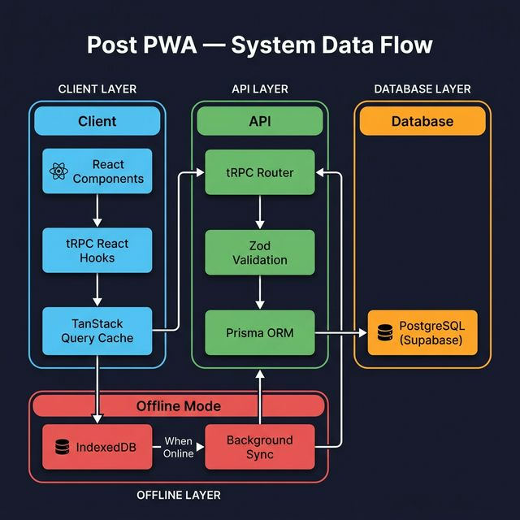
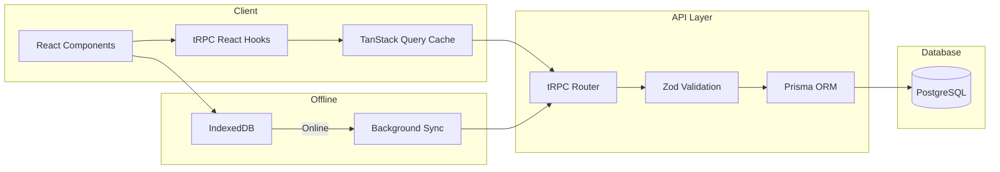
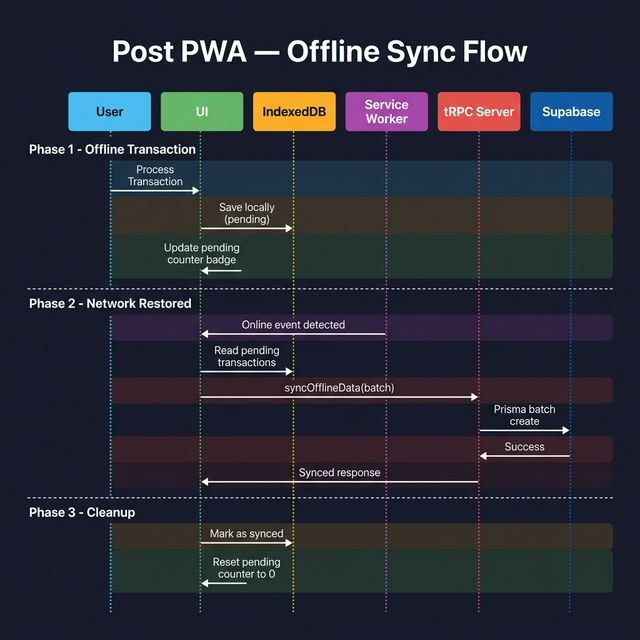
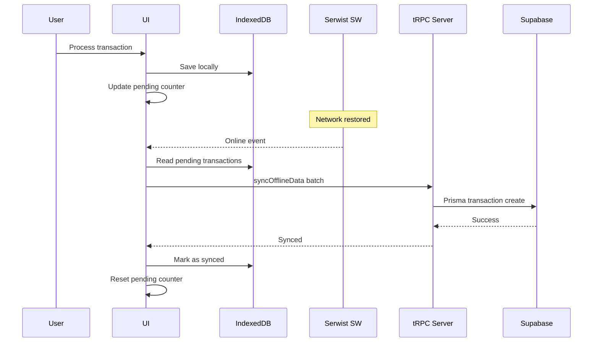

# Architecture — Post PWA (POS Offline-First)

> Modern offline-first Point of Sales PWA built on the T3 Stack.

---

## Tech Stack

| Layer | Technology | Version |
|-------|-----------|---------|
| Framework | Next.js (App Router) | 16+ |
| API | tRPC | 11 |
| Validation | Zod | 4 |
| ORM | Prisma | 7 |
| Database | PostgreSQL (Supabase) | — |
| Styling | Tailwind CSS | 4 |
| UI Components | Shadcn UI + Radix UI | — |
| PWA Engine | Serwist | 9 |
| State / Data Fetching | TanStack React Query | 5 |
| Charts | Recharts | 2 |
| Drawer (Mobile UX) | Vaul | 1 |
| Theme | next-themes | 0.4 |
| Toast | Sonner | 2 |

---

## Directory Structure

```
src/
├── app/                    # Next.js App Router (pages & API)
│   ├── api/                # tRPC HTTP handler
│   ├── cashier/            # /cashier route
│   ├── product/            # /product route
│   ├── report/             # /report route
│   ├── store-settings/     # /store-settings route
│   ├── ~offline/           # Offline fallback page
│   ├── layout.tsx          # Root layout (providers, sidebar)
│   ├── page.tsx            # Dashboard (/) route
│   └── sw.ts               # Serwist Service Worker entry
│
├── components/
│   ├── config/             # App-wide config components
│   ├── elements/           # Shared elements (Header, etc.)
│   ├── form/               # Reusable form components
│   ├── fragments/          # Layout fragments (AppSidebar)
│   ├── icons/              # Custom SVG icon components
│   ├── layouts/            # Layout wrappers
│   └── ui/                 # Shadcn UI primitives (21 components)
│
├── features/               # Feature modules (domain-driven)
│   ├── cashier/            # POS cashier feature
│   ├── dashboard/          # Dashboard & analytics
│   ├── product/            # Product management
│   ├── report/             # Transaction reports & export
│   └── storeSettings/      # Store configuration
│
├── hooks/                  # Global custom hooks
├── lib/                    # Utilities & shared libraries
├── server/                 # Backend layer
│   ├── api/
│   │   ├── routers/        # tRPC route handlers
│   │   ├── root.ts         # Router aggregation
│   │   └── trpc.ts         # tRPC context & middleware
│   ├── filters/            # Error filters
│   ├── services/           # Business services
│   └── validations/        # Zod schemas
│
├── styles/                 # Global CSS
└── trpc/                   # Client-side tRPC setup
    ├── query-client.ts     # TanStack Query client
    ├── react.tsx            # React tRPC provider
    └── server.ts           # Server-side tRPC caller
```

---

## Feature Module Pattern

Each feature under `src/features/` follows a consistent structure:

```
features/<feature>/
├── components/     # Feature-specific UI components
├── hooks/          # Feature-specific custom hooks
├── pages/          # Page-level components (mounted by App Router)
├── types/          # TypeScript types/interfaces
├── utils/          # Helper functions
└── constants/      # Static values (where applicable)
```

**Key principle:** Features are self-contained. Shared components live in `src/components/`, shared hooks in `src/hooks/`.

---

## Data Flow



<details>
<summary>📝 Mermaid Text Version</summary>



</details>

---

## Offline-First Architecture

The application uses a **queue-and-sync** pattern:



<details>
<summary>📝 Mermaid Text Version</summary>



</details>

**Key components:**
- `src/lib/offline-db.ts` — IndexedDB wrapper (Dexie-like API)
- `src/hooks/use-offline-sync.ts` — Sync orchestrator hook
- `src/hooks/useNetworkStatus.ts` — Online/offline state detector
- `src/app/sw.ts` — Serwist Service Worker (asset caching)

---

## UI Component Layers

```
Layer 1: Shadcn UI Primitives (src/components/ui/)
         ↓ composed into
Layer 2: Shared Elements (src/components/elements/, form/, fragments/)
         ↓ composed into
Layer 3: Feature Components (src/features/*/components/)
         ↓ assembled into
Layer 4: Pages (src/features/*/pages/ → mounted by src/app/)
```

**Mobile UX:** Responsive Drawer/Dialog pattern using Vaul — modals render as bottom sheets on mobile, standard dialogs on desktop.

---

## Key Design Decisions

### ADR-001: T3 Stack Foundation
**Decision:** Built on create-t3-app with Next.js + tRPC + Prisma.  
**Rationale:** Full type safety from database to UI, single language (TypeScript), minimal boilerplate.

### ADR-002: Offline-First with IndexedDB
**Decision:** Queue transactions locally in IndexedDB, batch sync on reconnect.  
**Rationale:** POS systems must work without internet. IndexedDB provides reliable, browser-native persistence with large storage.

### ADR-003: Feature-Based Module Structure
**Decision:** Organize by feature domain rather than technical layer.  
**Rationale:** Colocation of related code reduces context switching, makes features independently maintainable.

### ADR-004: Soft Delete for Products
**Decision:** Products are "deleted" by setting `isAvailable = false`, not removed from database.  
**Rationale:** Transaction history must preserve product data for reporting integrity.

### ADR-005: Vaul Drawer for Mobile Interactions
**Decision:** Use Vaul to render modals as bottom sheets on mobile.  
**Rationale:** Native-feeling swipeable drawers provide better mobile ergonomics than centered modals, especially with virtual keyboards.
