# BAB IV — HASIL DAN PEMBAHASAN

## 4.1 Implementasi Antarmuka Pengguna

Bagian ini memaparkan implementasi antarmuka pengguna (*user interface*) dari Sistem *Point of Sale* (POS) berbasis *Progressive Web Application* (PWA) untuk usaha Mie Jawa Melati. Sistem ini dibangun menggunakan *framework* Next.js versi 16 dengan arsitektur *App Router*, bahasa pemrograman TypeScript, serta antarmuka berbasis komponen yang memanfaatkan pustaka shadcn/ui. Seluruh halaman dirancang dengan pendekatan *mobile-first* dan responsif, sehingga dapat digunakan secara optimal baik pada perangkat seluler maupun komputer meja.

Sistem POS ini terdiri dari tujuh halaman utama yang masing-masing mengemban fungsi spesifik dalam mendukung operasional kasir harian: halaman *Login*, halaman Beranda, halaman *Dashboard*, halaman Kasir (*POS*), halaman Produk, halaman Laporan, dan halaman Pengaturan.

---

## 4.1.1 Halaman Login

Halaman *Login* merupakan gerbang utama sistem yang berfungsi sebagai mekanisme autentikasi pengguna sebelum dapat mengakses seluruh fitur aplikasi. Halaman ini mengimplementasikan pola keamanan berlapis (*layered security*): lapisan pertama berupa *middleware* server-side yang berjalan pada setiap permintaan HTTP untuk memvalidasi sesi Supabase Auth, dan lapisan kedua berupa *auth guard* sisi klien pada komponen `AppLayout` yang mencegah akses ke halaman yang dilindungi.

Apabila pengguna belum memiliki sesi yang valid, sistem secara otomatis mengalihkan (*redirect*) pengguna ke halaman ini tanpa mengekspos konten yang dilindungi.

Halaman *Login* tersusun atas beberapa komponen utama, di antaranya adalah identitas merek (*Brand Identity*) yang terdiri dari teks judul aplikasi "Mie Jawa POS" dan teks panduan "Masuk untuk melanjutkan". Selain itu, terdapat formulir autentikasi (*Login Form*) yang memiliki bidang masukan email dan kata sandi beserta tombol aksi "Masuk". Pada halaman ini juga disediakan penyedia layanan (*Service Provider*) berupa tautan autentikasi alternatif "Google" dan "GitHub" (jika diaktifkan) untuk mempermudah proses masuk pengguna.

### Tampilan Antarmuka

Gambar 4.1 menampilkan antarmuka halaman *Login* pada mode desktop dan *mobile*.

**Tampilan Desktop:**
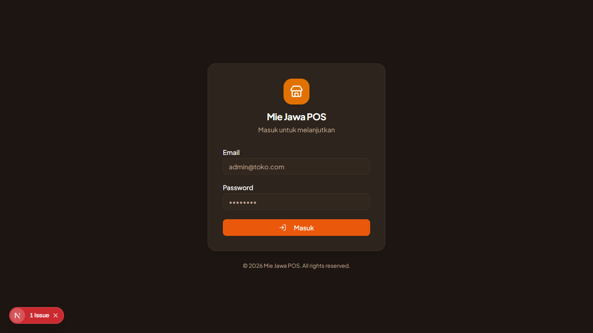

**Tampilan Mobile:**
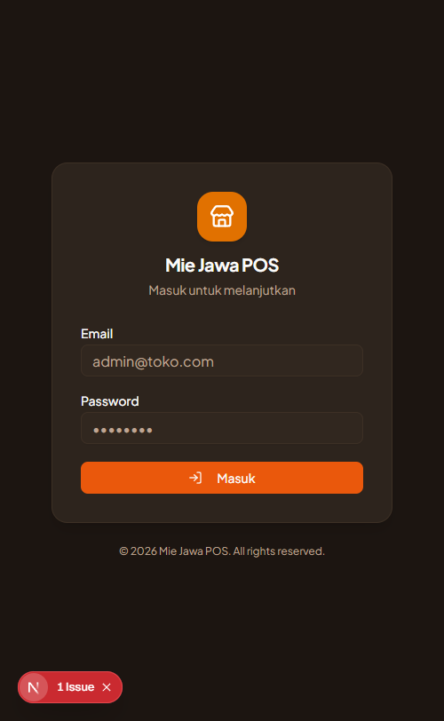

Selain tampilan utama, halaman *Login* juga dilengkapi dengan mekanisme umpan balik visual untuk menangani skenario kesalahan. Apabila pengguna memasukkan kredensial yang tidak tepat atau terjadi gangguan pada proses autentikasi, sistem akan menampilkan peringatan secara eksplisit. Gambar 4.2 menunjukkan kondisi ketika terjadi kesalahan masuk, di mana sistem memberikan notifikasi berwarna merah agar pengguna dapat segera mengidentifikasi dan memperbaiki kesalahannya.

**Kondisi Kesalahan Masuk:**
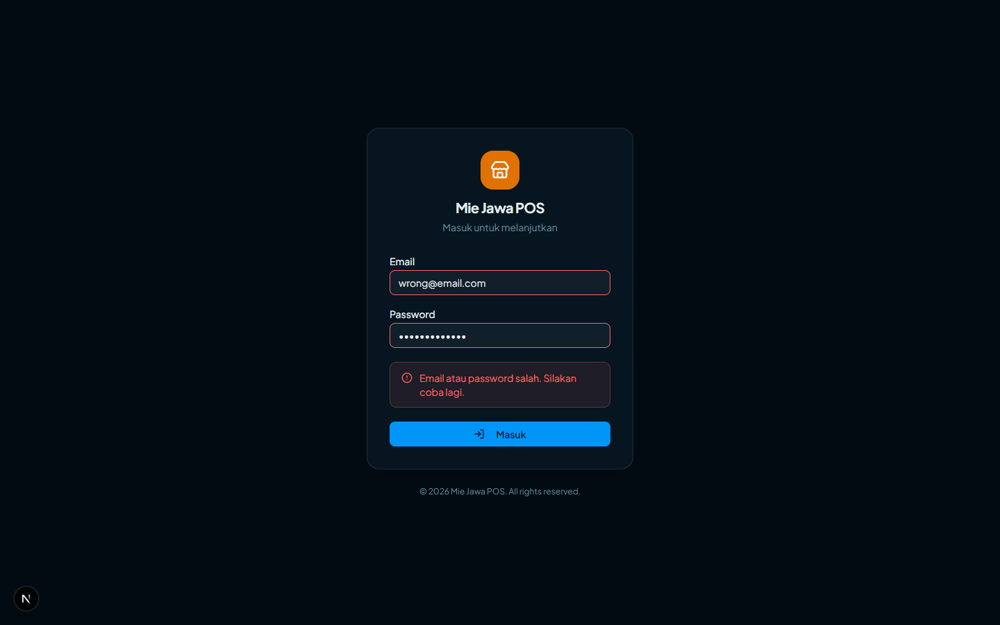

---

## 4.1.2 Halaman Beranda

Halaman Beranda merupakan halaman utama yang ditampilkan pertama kali setelah pengguna berhasil melakukan autentikasi. Halaman ini dirancang sebagai *command center* bagi operator kasir: menyajikan informasi ringkas kondisi bisnis terkini dan menyediakan akses cepat (*quick access*) menuju seluruh fitur utama sistem. 

Halaman Beranda terdiri atas tiga komponen utama yang dirancang untuk memberikan informasi dan navigasi cepat. Komponen pertama adalah spanduk sambutan (*Greeting Banner*) yang menampilkan sapaan kontekstual, nama toko ("Mie Jawa Melati"), waktu terkini secara *real-time*, dan status koneksi jaringan ("Online"). Komponen kedua adalah statistik ringkas (*Mini Stats*) berupa kartu "Omzet Hari Ini" dan "Total Transaksi" yang dihitung secara langsung dari *database* Supabase. Komponen ketiga berupa grid aksi cepat (*Quick Action Grid*) yang menyediakan empat kartu navigasi utama untuk menuju Kasir, Kelola Produk, Laporan, dan Dashboard.

### Tampilan Antarmuka

Gambar 4.2 menampilkan antarmuka halaman Beranda yang menunjukkan spanduk sambutan dinamis, dua kartu statistik harian, dan empat kartu aksi cepat.

**Tampilan Desktop:**
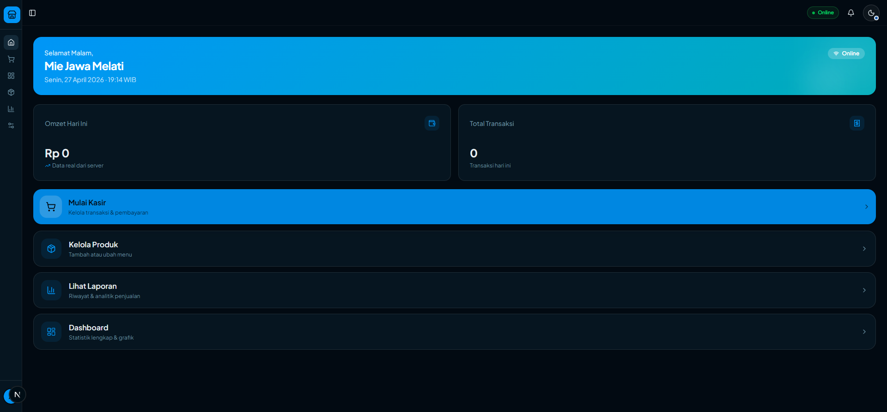

**Tampilan Mobile:**
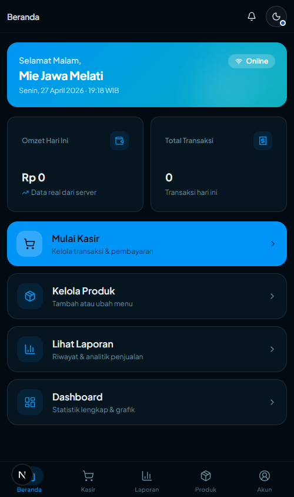

---

## 4.1.3 Halaman Kasir (POS)

Halaman Kasir merupakan komponen inti dari sistem POS yang digunakan untuk memproses seluruh transaksi penjualan. Fungsi utamanya meliputi pemilihan produk dari katalog, proses pembayaran dengan berbagai metode, hingga pencetakan struk melalui printer Bluetooth. Halaman ini mengimplementasikan desain responsif dengan tata letak berbeda untuk kondisi desktop (dua kolom) dan kondisi *mobile* (satu kolom dengan tombol keranjang melayang).

Komponen antarmuka pada halaman Kasir terbagi menjadi dua area fungsional utama. Area pertama adalah katalog produk (*Product Catalog*) yang menampilkan seluruh produk yang tersedia dan dilengkapi dengan filter kategori berbentuk tombol (seperti *Semua*, *Makanan*, *Minuman*, dan *Tambahan*). Area kedua adalah panel keranjang belanja (*Cart Panel*) yang mencantumkan daftar pesanan, subtotal, total tagihan, dan tombol "Bayar Sekarang". Pada tampilan antarmuka *desktop*, panel keranjang berada di sisi kanan, sedangkan pada versi *mobile*, keranjang ditampilkan secara melayang (*floating*) apabila terdapat item pesanan.

### Tampilan Antarmuka

Gambar 4.3 menampilkan antarmuka halaman Kasir dengan katalog produk, filter kategori, dan antarmuka keranjang belanja.

**Tampilan Desktop:**
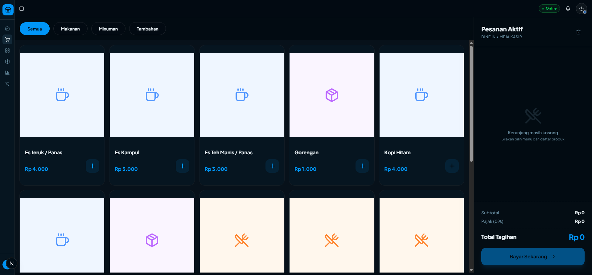

**Tampilan Mobile:**
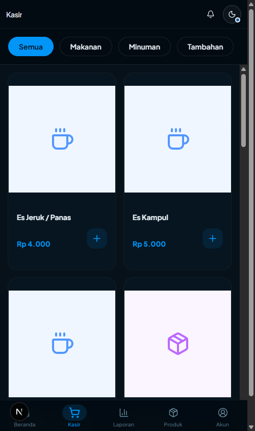

Dalam mendukung fleksibilitas transaksi, halaman Kasir dilengkapi dengan fitur penambahan catatan spesifik pada setiap item pesanan. Dengan menekan tombol tambah catatan pada daftar keranjang, akan muncul sebuah modal yang memungkinkan kasir untuk memasukkan instruksi khusus dari pelanggan (misalnya: "pedas" atau "tanpa sayur"). Tampilan modal catatan pesanan ini dapat dilihat pada Gambar 4.4.

**Modal Catatan Pesanan:**
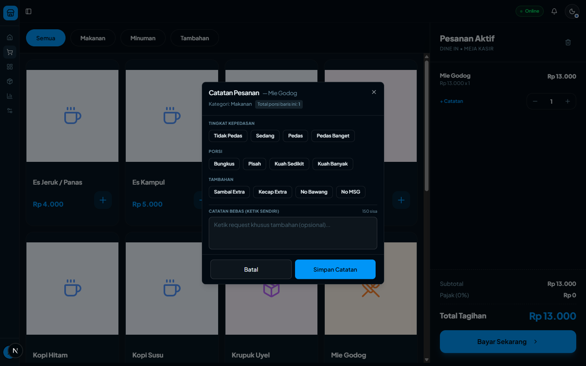

Setelah seluruh pesanan dikonfirmasi dan kasir menekan tombol "Bayar Sekarang", sistem akan memunculkan sebuah modal Konfirmasi Pembayaran. Modal ini mengunci layar di belakangnya untuk memastikan fokus kasir pada proses krusial, yaitu penerimaan dana. Di dalamnya, kasir diharuskan untuk memasukkan nominal uang yang diterima dari pelanggan sebelum dapat menyelesaikan transaksi. Antarmuka modal Konfirmasi Pembayaran ditunjukkan pada Gambar 4.5.

**Konfirmasi Pembayaran:**
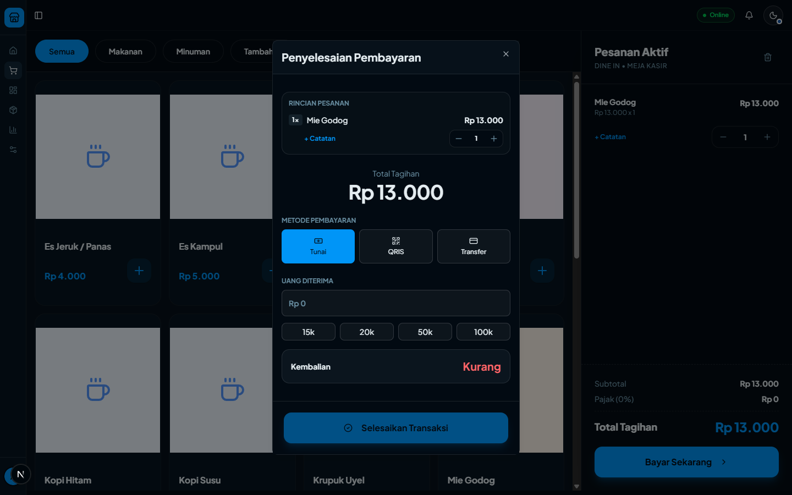

Sesaat setelah proses pembayaran dinyatakan berhasil oleh sistem, antarmuka akan beralih menampilkan modal Nota Pembayaran. Modal ini berisi rangkuman struk digital yang mencantumkan detail pesanan, total harga, uang diterima, dan kembalian. Pada antarmuka ini pula, pengguna diberikan opsi lanjutan untuk mencetak struk fisik melalui printer Bluetooth yang telah dikonfigurasi. Tampilan modal Nota Pembayaran dapat dilihat pada Gambar 4.6.

**Nota Pembayaran:**
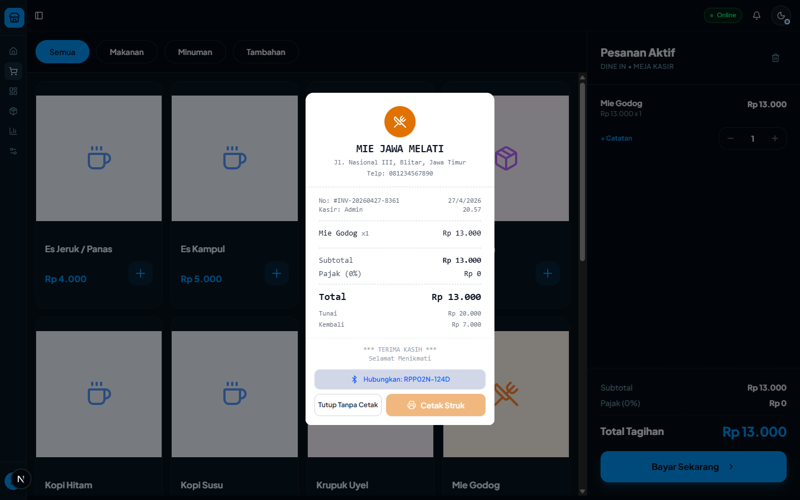

---

## 4.1.4 Halaman Dashboard

Halaman *Dashboard* merupakan pusat analitik bisnis yang menyajikan statistik penjualan secara komprehensif dan visual. Halaman ini diperuntukkan bagi pemilik toko untuk memantau performa bisnis, mengidentifikasi tren pendapatan historis, dan mengetahui produk-produk yang paling diminati pelanggan. 

Antarmuka halaman *Dashboard* dibangun menggunakan tiga komponen visual utama untuk analitik data. Komponen pertama adalah kartu *Key Performance Indicator* (KPI) yang terdiri dari empat kartu statistik meliputi Omzet Hari Ini, Total Transaksi, Rata-rata per Transaksi, dan Menu Terlaris. Komponen kedua adalah grafik pendapatan (*Revenue Chart*) yang memvisualisasikan data pendapatan dalam bentuk grafik batang interaktif dengan opsi filter 7, 14, atau 30 hari. Komponen terakhir adalah tabel produk teratas (*Top Products*) yang merangkum daftar menu dengan angka penjualan tertinggi.

### Tampilan Antarmuka

Gambar 4.4 menampilkan antarmuka halaman *Dashboard* dengan empat kartu KPI, grafik batang pendapatan 7 hari terakhir, dan tabel produk terlaris.

**Tampilan Desktop:**
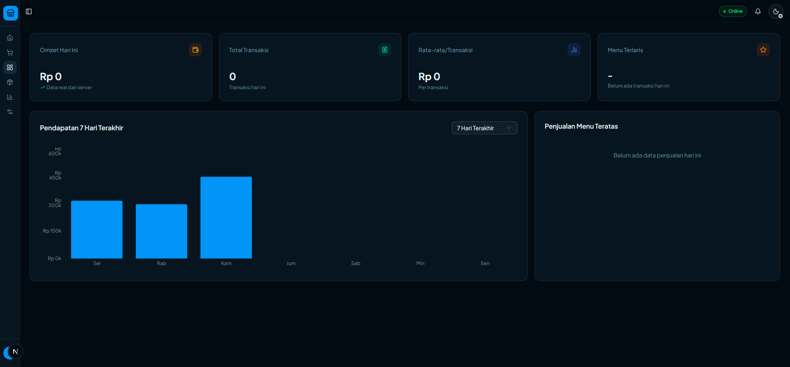

**Tampilan Mobile:**
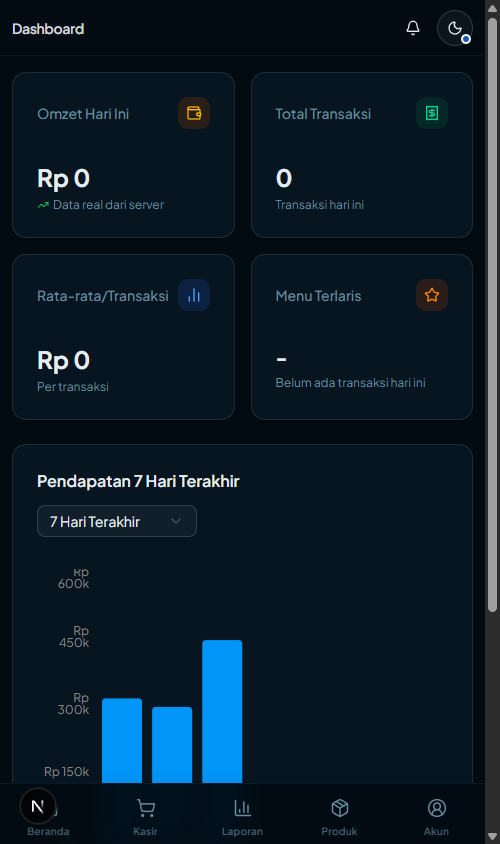

---

## 4.1.5 Halaman Manajemen Produk

Halaman Manajemen Produk menyediakan antarmuka administrasi untuk mengelola seluruh katalog menu yang tersedia pada sistem kasir. Administrator dapat menambahkan produk baru, mengubah informasi produk yang sudah ada (nama, harga), dan menghapus produk.

Halaman Manajemen Produk memiliki dua komponen antarmuka yang esensial. Komponen pertama berupa bilah alat pencarian yang memungkinkan pengguna untuk memfilter daftar produk secara *real-time* berdasarkan nama. Komponen kedua adalah tabel produk interaktif yang menyajikan rincian informasi berupa Nama Produk, Harga dalam Rupiah, serta dilengkapi dengan kolom aksi yang berisi tombol untuk menyunting (Edit) maupun menghapus (Hapus) data produk yang bersangkutan.

### Tampilan Antarmuka

Gambar 4.5 menampilkan antarmuka halaman Manajemen Produk dengan tabel daftar produk, bilah alat pencarian, dan tombol aksi.

**Tampilan Desktop:**
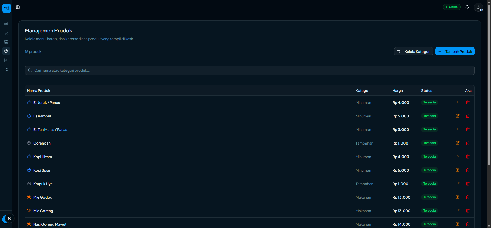

**Tampilan Mobile:**
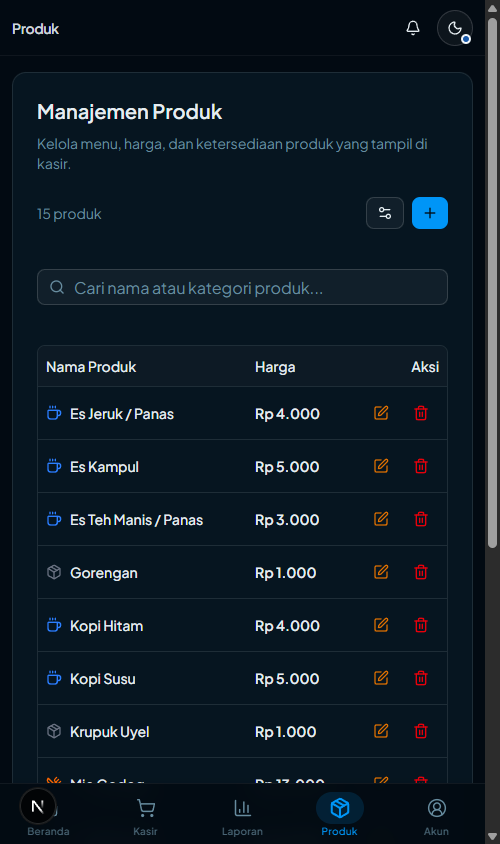

Untuk menjaga kerapian antarmuka utama, proses penambahan produk baru maupun penyuntingan produk eksisting tidak dilakukan pada halaman terpisah, melainkan melalui antarmuka *drawer* (panel samping geser) atau modal di tengah layar (bergantung pada orientasi perangkat). Pendekatan desain ini memungkinkan pengguna untuk tetap melihat daftar produk di latar belakang saat mengisi formulir rincian produk seperti nama, harga, dan kategorinya. Antarmuka formulir ini ditampilkan pada Gambar 4.8.

**Form Tambah/Ubah Produk:**
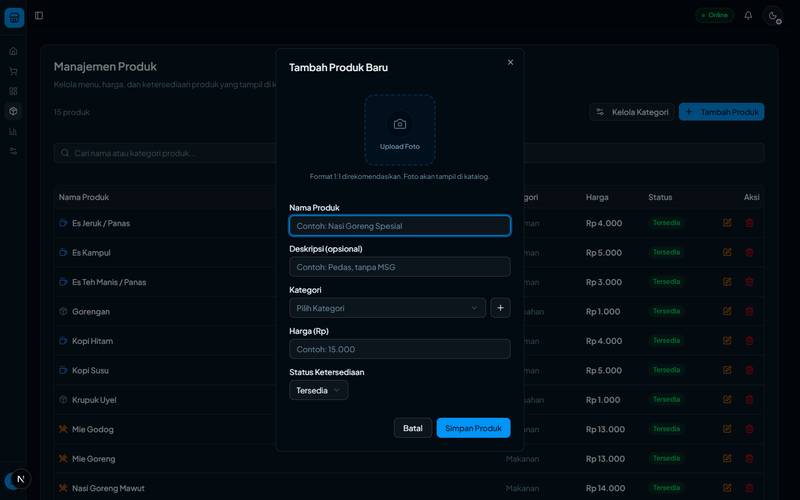

Selain mengelola produk individual, halaman ini juga menyediakan fungsionalitas untuk mengatur kelompok produk melalui fitur Kelola Kategori. Saat fitur ini diakses, sebuah modal manajemen akan tampil di atas antarmuka utama, memungkinkan administrator untuk membuat kategori baru, mengubah nama kategori lama, ataupun menghapusnya, guna memastikan katalog produk tetap terstruktur dengan baik. Tampilan modal Kelola Kategori dapat dilihat pada Gambar 4.9.

**Kelola Kategori:**
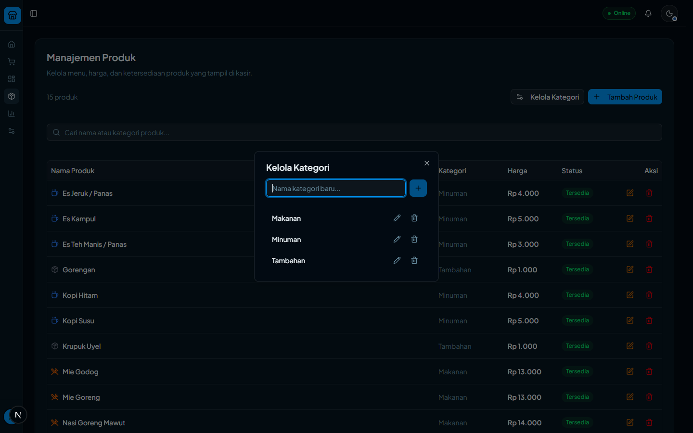

---

## 4.1.6 Halaman Laporan Penjualan

Halaman Laporan Penjualan menyajikan rekapitulasi riwayat seluruh transaksi yang telah dilakukan. Halaman ini dirancang untuk memenuhi kebutuhan analisis penjualan dan pembukuan, memungkinkan pencarian nota spesifik dan melihat total pendapatan.

Komponen antarmuka utama pada halaman Laporan Penjualan mencakup kartu ringkasan statistik dan tabel riwayat transaksi. Kartu ringkasan statistik berfungsi untuk menampilkan indikator penjualan kunci, yaitu Total Pendapatan, Jumlah Transaksi, dan Rata-rata per Transaksi. Di bawahnya terdapat tabel riwayat transaksi yang menampilkan daftar seluruh transaksi yang pernah terjadi secara komprehensif, mencakup status waktu transaksi serta total belanja dari masing-masing nota.

### Tampilan Antarmuka

Gambar 4.6 menampilkan antarmuka halaman Laporan Penjualan dengan ringkasan laporan dan tabel riwayat transaksi.

**Tampilan Desktop:**
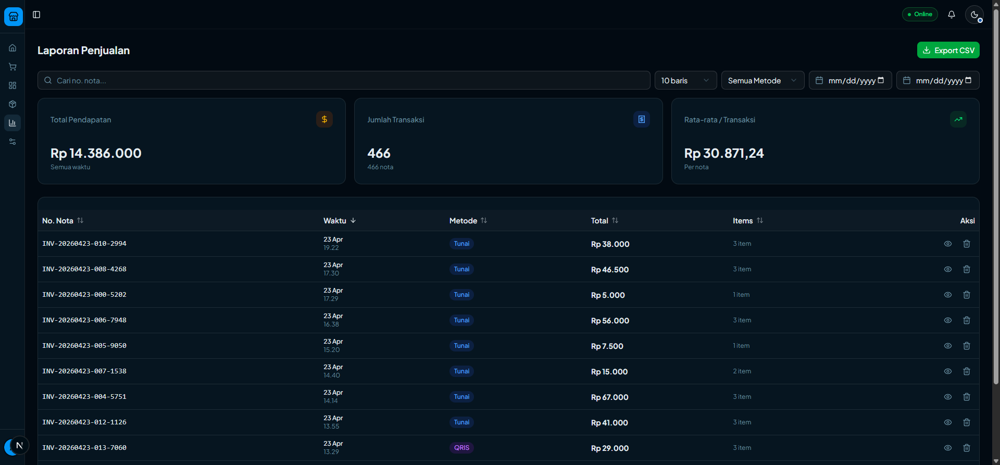

**Tampilan Mobile:**
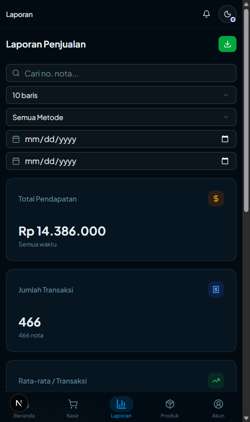

Meskipun tabel riwayat memberikan ringkasan yang memadai, terkadang analisis mendalam menuntut kasir atau pemilik untuk melihat rincian item apa saja yang terjual dalam suatu transaksi tertentu. Untuk memfasilitasi kebutuhan ini, pengguna dapat mengklik salah satu baris pada tabel riwayat untuk memunculkan modal Detail Transaksi. Modal ini akan menampilkan struk digital lengkap dari transaksi terpilih, mirip dengan nota saat pembayaran, guna keperluan audit atau pencetakan ulang. Antarmuka modal Detail Transaksi ditunjukkan pada Gambar 4.11.

**Detail Transaksi:**
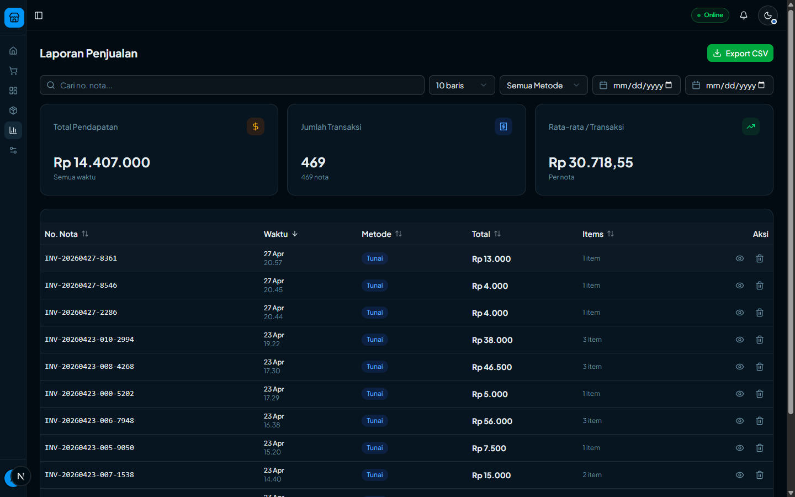

---

## 4.1.7 Halaman Pengaturan

Halaman Pengaturan merupakan pusat konfigurasi sistem yang memungkinkan pemilik toko untuk mengubah informasi identitas toko (nama, alamat, telepon) serta mengelola koneksi printer Bluetooth. 

Halaman Pengaturan diimplementasikan dengan dua komponen pengaturan utama. Komponen pertama adalah bilah navigasi tab yang berfungsi untuk beralih antara pengaturan "Info Toko" dan pengaturan "Printer". Komponen kedua adalah formulir Info Toko itu sendiri, yang mengakomodasi pengaturan *Logo Toko*, *Nama Toko*, *Alamat Lengkap*, dan *Nomor Telepon*, sehingga memungkinkan pemilik bisnis untuk memutakhirkan identitas usahanya dengan mudah.

### Tampilan Antarmuka

Gambar 4.7 menampilkan antarmuka halaman Pengaturan.

**Tampilan Desktop:**
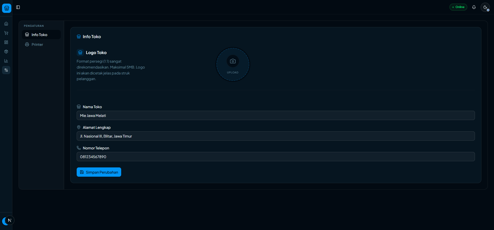

**Tampilan Mobile:**
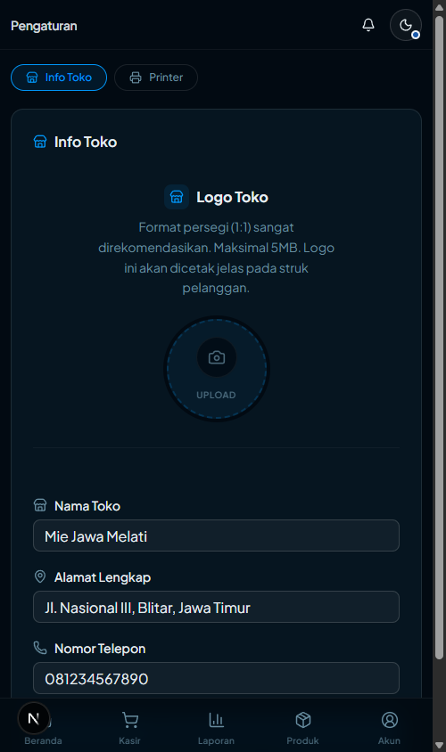

Halaman pengaturan dibagi menjadi beberapa panel yang secara hierarkis tersembunyi di balik navigasi tab untuk mencegah antarmuka yang terlalu padat. Pada tab "Info Toko", pengguna disajikan panel formulir terstruktur untuk memperbarui data identitas bisnis. Tampilan spesifik dari Panel Info Toko ini dapat dilihat pada Gambar 4.13.

**Panel Info Toko:**
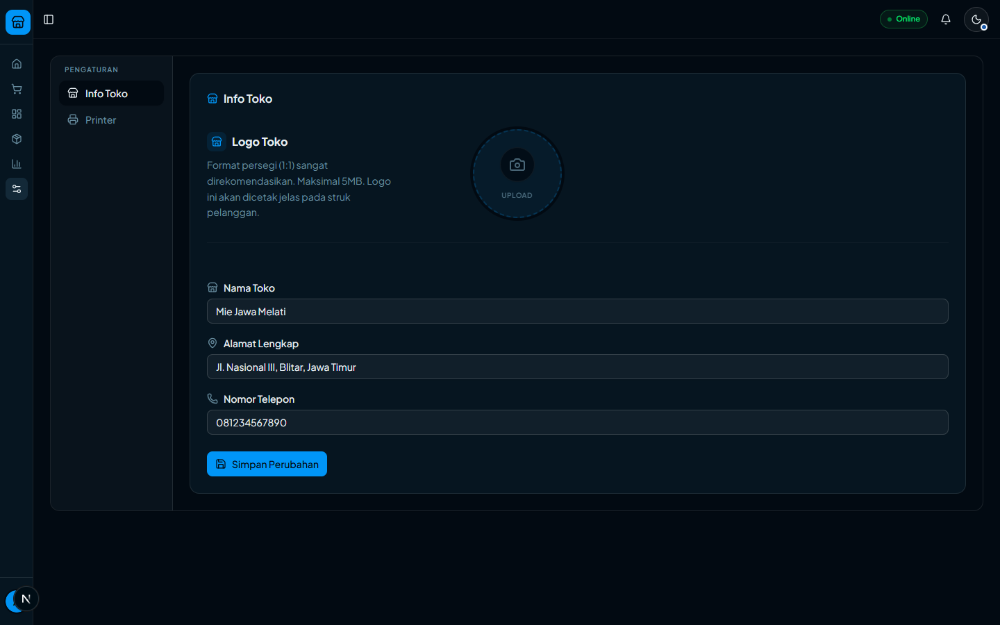

Ketika pengguna beralih ke tab "Printer", antarmuka akan mengganti panel yang aktif dengan antarmuka manajemen perangkat cetak. Pada Panel Pengaturan Printer ini, pengguna dapat memindai (*scan*), menyambungkan (*connect*), menguji pencetakan (*test print*), serta mengatur format struk. Tampilan antarmuka ini terpusat pada pengelolaan konektivitas perangkat keras Bluetooth, sebagaimana ditampilkan pada Gambar 4.14.

**Panel Pengaturan Printer:**
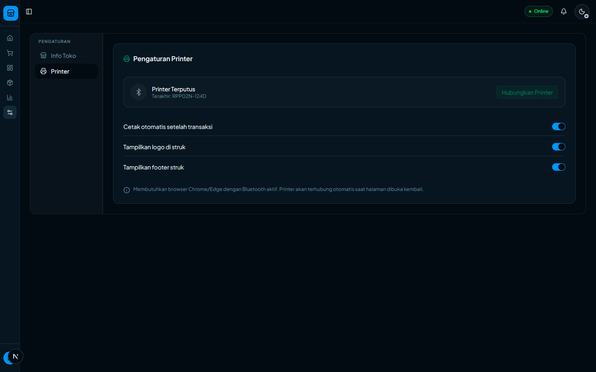

Selain pengaturan toko dan perangkat, sistem juga mengakomodasi preferensi pengguna individual melalui Panel Profil Akun. Bagian ini dikhususkan untuk mengelola kredensial sesi yang sedang aktif, termasuk opsi untuk memperbarui nama pengguna maupun mengganti kata sandi. Tampilan Panel Profil Akun ditunjukkan pada Gambar 4.15.

**Panel Profil Akun:**
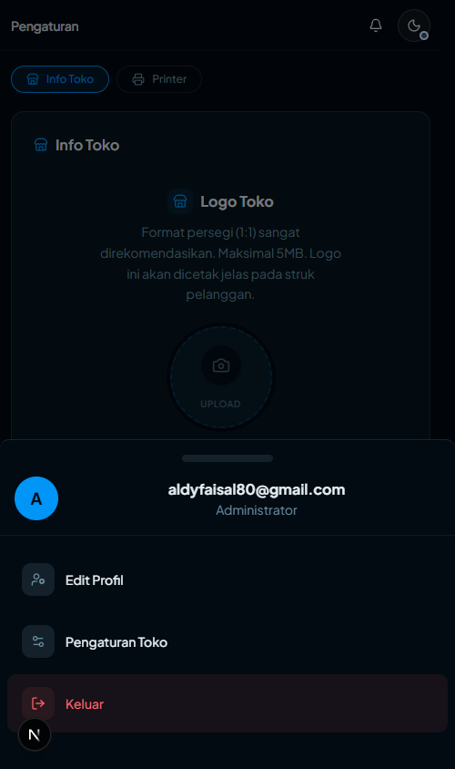

Khusus pada antarmuka *mobile* di mana ruang horizontal sangat terbatas, navigasi ke pengaturan profil akun tidak menggunakan tab menu samping, melainkan mengadopsi pola desain *Bottom Sheet Drawer* (laci bawah). Saat pengguna menyentuh foto profilnya di bilah navigasi bawah, menu profil akan muncul meluncur dari bawah layar, memberikan akses ke pengaturan akun maupun opsi untuk keluar (*logout*) dengan cara yang ergonomis untuk ibu jari. Tampilan menu *drawer* akun ponsel ini dapat dilihat pada Gambar 4.16.

**Menu Akun Ponsel:**
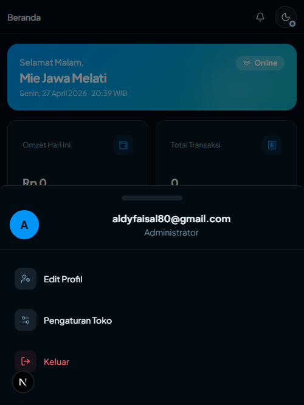
