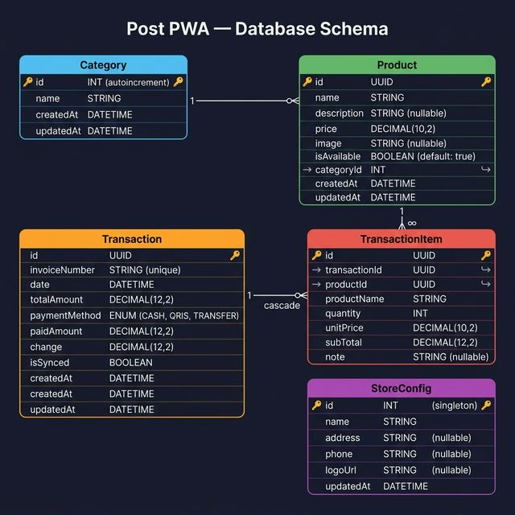
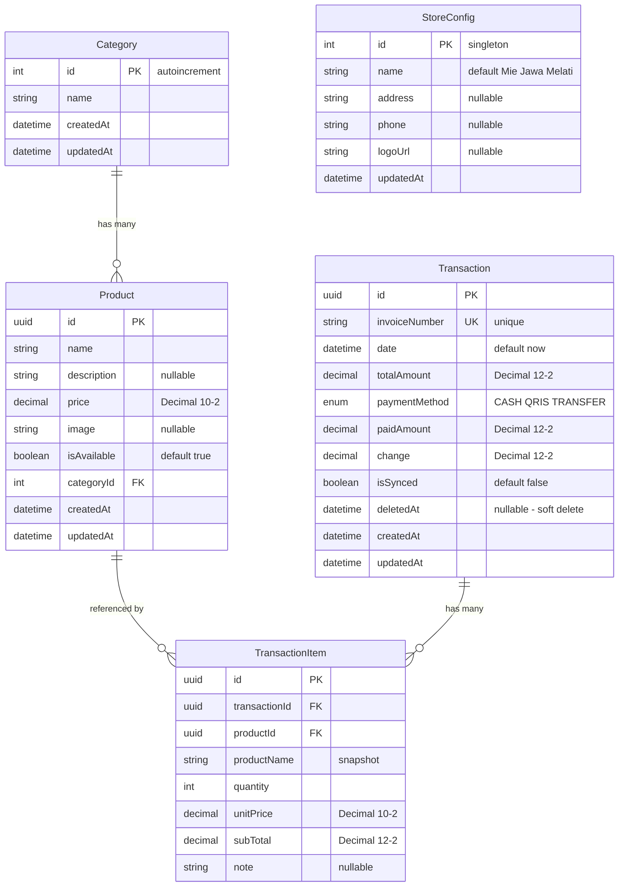

# Database Schema — Post PWA

> PostgreSQL via Supabase, managed with Prisma ORM v7.

---

## ER Diagram



<details>
<summary>📝 Mermaid Text Version</summary>



</details>

---

## Model Reference

### Category

| Field | Type | Constraints | Description |
|-------|------|-------------|-------------|
| `id` | `Int` | PK, autoincrement | Unique category ID |
| `name` | `String` | required | Category display name |
| `createdAt` | `DateTime` | default: `now()` | Creation timestamp |
| `updatedAt` | `DateTime` | auto-updated | Last update timestamp |

### Product

| Field | Type | Constraints | Description |
|-------|------|-------------|-------------|
| `id` | `String` (UUID) | PK, `uuid()` | Unique product ID |
| `name` | `String` | required | Product name |
| `description` | `String?` | optional | Product description |
| `price` | `Decimal(10,2)` | required | Unit price |
| `image` | `String?` | optional | Product image URL |
| `isAvailable` | `Boolean` | default: `true` | Soft delete flag |
| `categoryId` | `Int` | FK → Category | Parent category |

**Indexes:** `categoryId`

> **Note:** Deleting a product sets `isAvailable = false` (soft delete) to preserve transaction history integrity.

### Transaction

| Field | Type | Constraints | Description |
|-------|------|-------------|-------------|
| `id` | `String` (UUID) | PK, `uuid()` | Transaction ID |
| `invoiceNumber` | `String` | unique | Format: `INV-YYYYMMDD-XXXX` |
| `date` | `DateTime` | default: `now()` | Transaction date |
| `totalAmount` | `Decimal(12,2)` | required | Total bill amount |
| `paymentMethod` | `PaymentMethod` | default: `CASH` | Payment type enum |
| `paidAmount` | `Decimal(12,2)` | required | Amount paid by customer |
| `change` | `Decimal(12,2)` | required | Change returned |
| `isSynced` | `Boolean` | default: `false` | Offline sync status |
| `deletedAt` | `DateTime?` | optional | Soft delete timestamp (`null` = active) |

**Indexes:** `date`, `isSynced`, `deletedAt`

> **Note:** Deleting a transaction sets `deletedAt` to current timestamp (soft delete). All queries filter `deletedAt: null` to exclude deleted records.

### TransactionItem

| Field | Type | Constraints | Description |
|-------|------|-------------|-------------|
| `id` | `String` (UUID) | PK, `uuid()` | Item line ID |
| `transactionId` | `String` | FK → Transaction | Parent transaction (cascade delete) |
| `productId` | `String` | FK → Product | Product reference |
| `productName` | `String` | required | Snapshot of product name at purchase time |
| `quantity` | `Int` | required | Quantity ordered |
| `unitPrice` | `Decimal(10,2)` | required | Snapshot of unit price at purchase time |
| `subTotal` | `Decimal(12,2)` | required | `quantity × unitPrice` |
| `note` | `String?` | optional | Item-specific notes (e.g. "no spice") |

**Indexes:** `transactionId`

### StoreConfig

| Field | Type | Constraints | Description |
|-------|------|-------------|-------------|
| `id` | `Int` | PK, default: `1` | Singleton row |
| `name` | `String` | default: `"Mie Jawa Melati"` | Store name |
| `address` | `String?` | optional | Store address |
| `phone` | `String?` | optional | Store phone |
| `logoUrl` | `String?` | optional | Store logo URL |

---

## Enums

### PaymentMethod

| Value | Description |
|-------|-------------|
| `CASH` | Cash payment |
| `QRIS` | QRIS digital payment |
| `TRANSFER` | Bank transfer |

---

## Seed Data

The seed script (`prisma/seed.ts`) populates:
- Sample categories (food types)
- Sample products with prices
- Sample transactions with items

Run with:
```bash
npm run db:seed:local
```

---

## Common Commands

| Command | Description |
|---------|-------------|
| `npm run db:push` | Push schema to default database |
| `npm run db:push:local` | Push to local dev database |
| `npm run db:push:prod` | Push to production database |
| `npm run db:reset:local` | Reset local DB + re-seed |
| `npm run db:seed:local` | Seed local database |
| `npm run db:studio` | Open Prisma Studio GUI |
