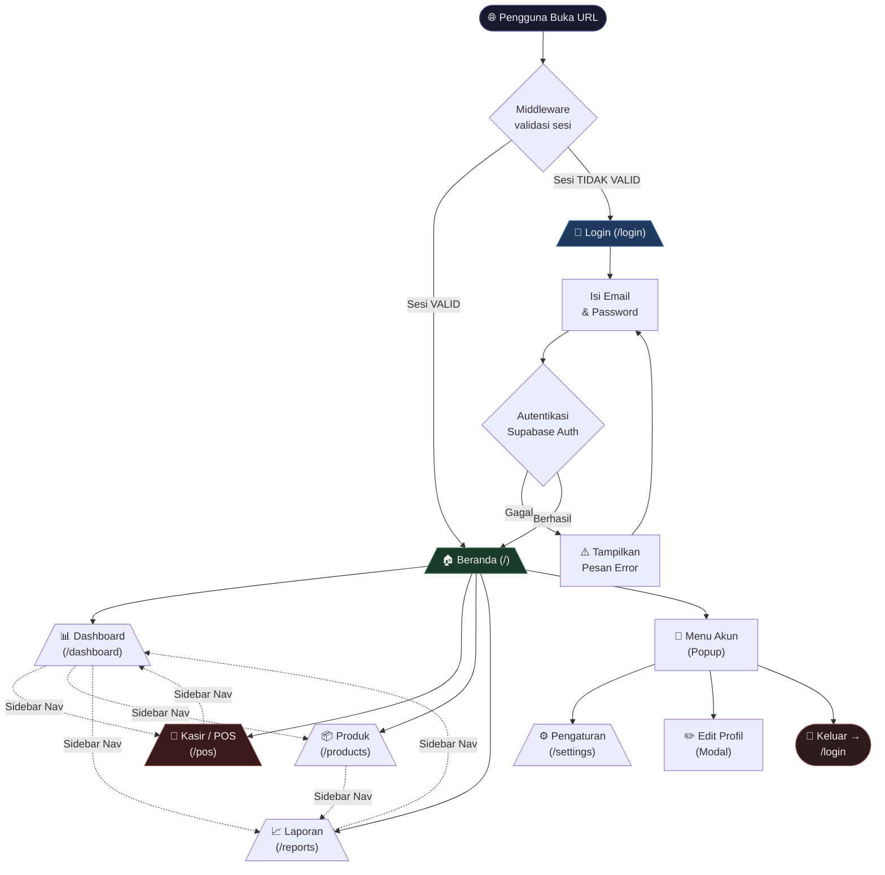
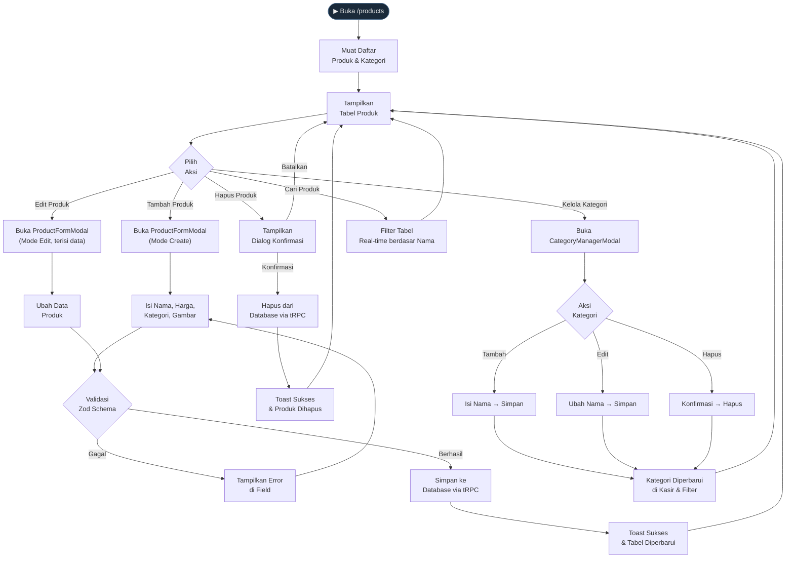
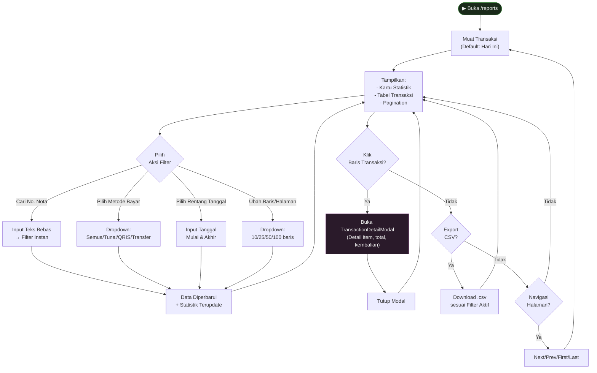
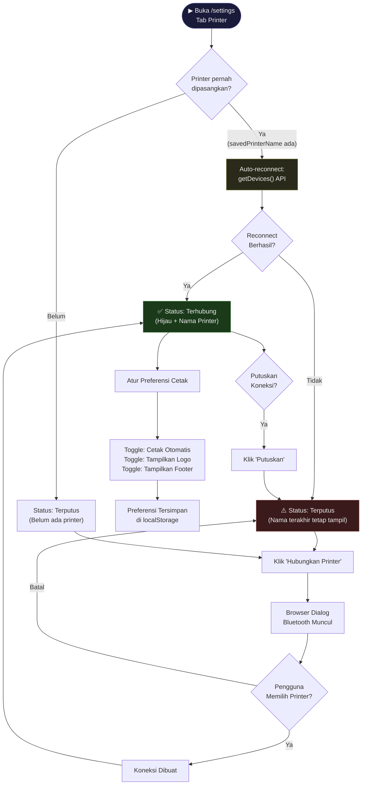
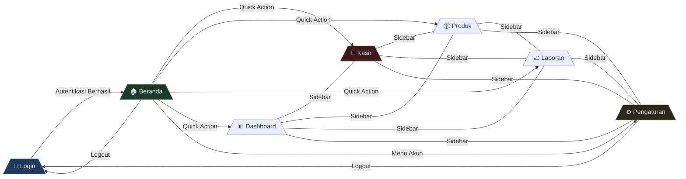

# Diagram Alur Aplikasi POS Mie Jawa Melati

> Dokumen ini berisi diagram-diagram alur yang menggambarkan navigasi dan proses utama dalam aplikasi POS PWA.
> Cocok untuk dimasukkan ke laporan skripsi sebagai lampiran diagram atau di dalam BAB IV.

---

## 1. Diagram Alur Navigasi Sistem (Flowchart Halaman)

Diagram ini menggambarkan keseluruhan struktur navigasi antar halaman aplikasi, dimulai dari akses awal hingga seluruh fitur tersedia.

---

## 2. Diagram Alur Proses Transaksi Kasir (Activity Diagram)

Diagram ini menggambarkan alur lengkap satu siklus transaksi kasir, dari pembukaan halaman hingga keranjang dikosongkan untuk transaksi berikutnya.

```mermaid
flowchart TD
    A(["▶ Buka /pos"]) --> B["Muat Produk\ndari Server"]
    B --> C["Tampilkan Katalog\n& Filter Kategori"]
    C --> D{"Pilih\nKategori?"}
    D -- "Ya" --> E["Filter Produk\nberdasar Kategori"]
    D -- "Tidak" --> F["Tampilkan\nSemua Produk"]
    E --> G["Klik Kartu Produk"]
    F --> G

    G --> H["Item Ditambah\nke Keranjang"]
    H --> I{"Edit\nKuantitas?"}
    I -- "Ya" --> J["Input Angka / ±\ndi Keranjang"]
    J --> K{"Tambah\nCatatan?"}
    I -- "Tidak" --> K
    K -- "Ya" --> L["Buka NoteModal\n→ Isi Catatan\n(+ opsional split qty)"]
    L --> M{"Tambah\nItem Lain?"}
    K -- "Tidak" --> M
    M -- "Ya" --> G
    M -- "Tidak" --> N["Klik Tombol 'Bayar'"]

    N --> O["Buka CheckoutModal\nRingkasan Pesanan"]
    O --> P{"Pilih\nMetode Bayar"}
    P -- "Tunai (CASH)" --> Q["Masukkan\nNominal Diterima"]
    Q --> R["Hitung Kembalian\nOtomatis"]
    R --> S["Klik 'Proses'"]
    P -- "QRIS / Transfer" --> S

    S --> T{"Koneksi\nInternet?"}
    T -- "Online" --> U["Simpan ke Supabase\n(Server)"]
    T -- "Offline" --> V["Simpan ke\nAntrean Lokal"]
    V --> W["Sync otomatis\nsaat Online kembali"]

    U --> X["Tampilkan\nReceiptModal\n(Struk Digital)"]
    W --> X

    X --> Y{"Cetak\nStruk?"}
    Y -- "Ya" --> Z["Cetak via\nBluetooth Printer\n(Web BT API)"]
    Z --> AA["Klik 'Selesai'"]
    Y -- "Tidak" --> AA
    AA --> AB(["🔄 Keranjang Dikosongkan\n→ Siap Transaksi Baru"])

    style A fill:#1a3a2a,color:#eee,stroke:#4a8a6a
    style AB fill:#1a3a2a,color:#eee,stroke:#4a8a6a
    style T fill:#3a3a1a,color:#eee,stroke:#8a8a4a
    style V fill:#3a2a1a,color:#eee,stroke:#8a6a4a
    style W fill:#3a2a1a,color:#eee,stroke:#8a6a4a
```

---

## 3. Diagram Alur Manajemen Produk (CRUD Flowchart)

Diagram ini menggambarkan operasi-operasi yang tersedia pada halaman Manajemen Produk.

---

## 4. Diagram Alur Laporan Penjualan (Reporting Flowchart)

---

## 5. Diagram Alur Pengaturan Printer Bluetooth

---

## 6. Diagram Relasi Antar Halaman (Navigation Map)

---

## Keterangan Diagram

| Simbol | Makna |
|--------|-------|
| `(["..."])` | Titik Mulai / Titik Akhir (Terminal) |
| `[/"..."\]` | Halaman / Layar |
| `{"..."}` | Kondisi / Keputusan (*Decision*) |
| `["..."]` | Proses / Aksi (*Process*) |
| `-->` | Alur utama (*Primary Flow*) |
| `-.->` | Alur opsional / navigasi sidebar |
| `---|` | Akses dua arah (*Bidirectional*) |
