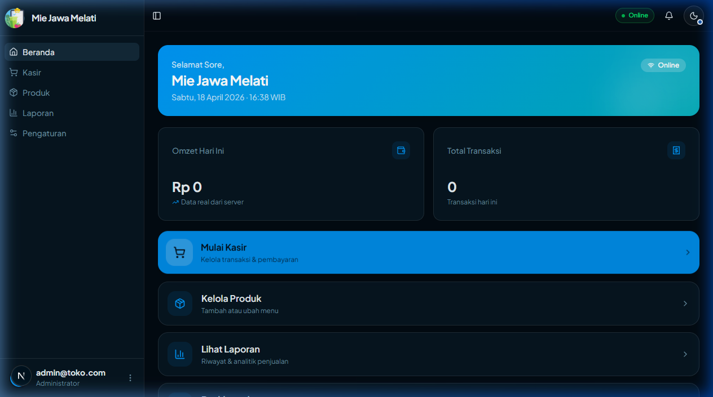
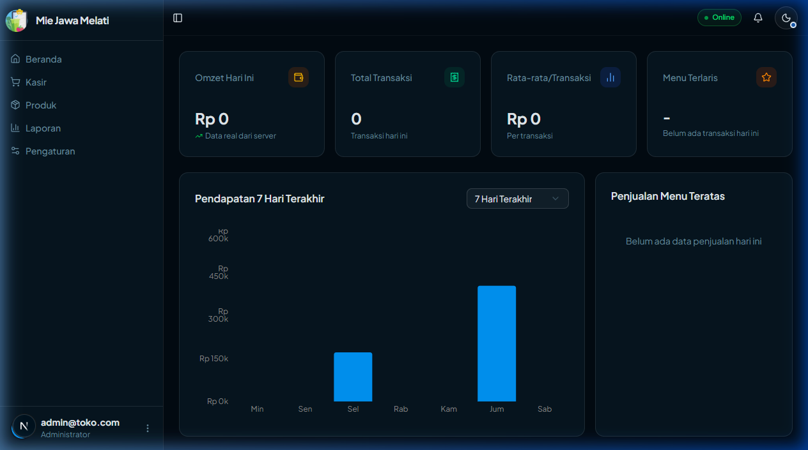
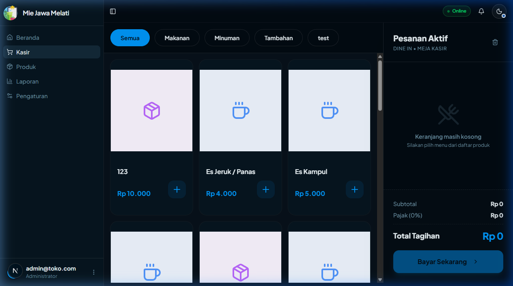
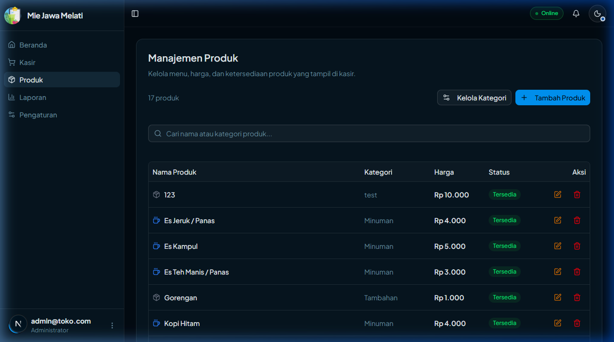
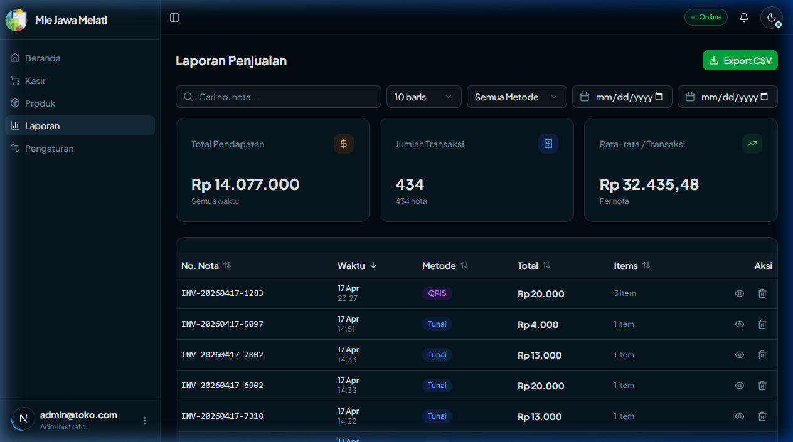
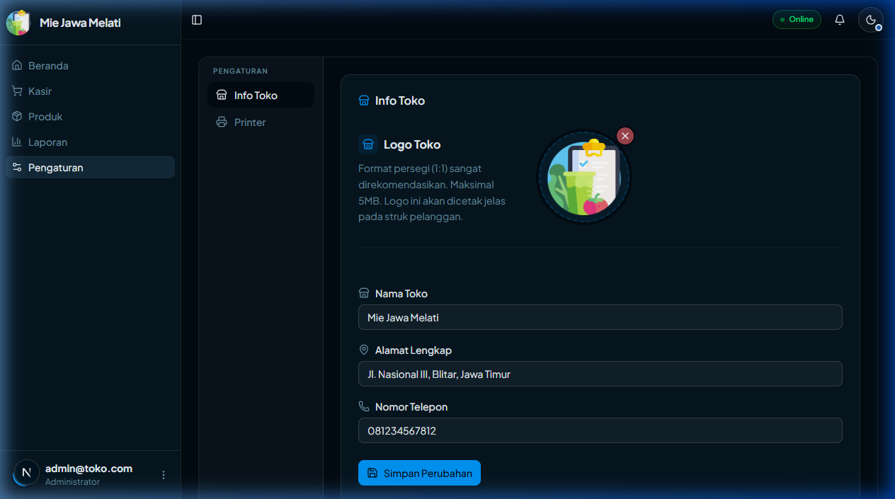
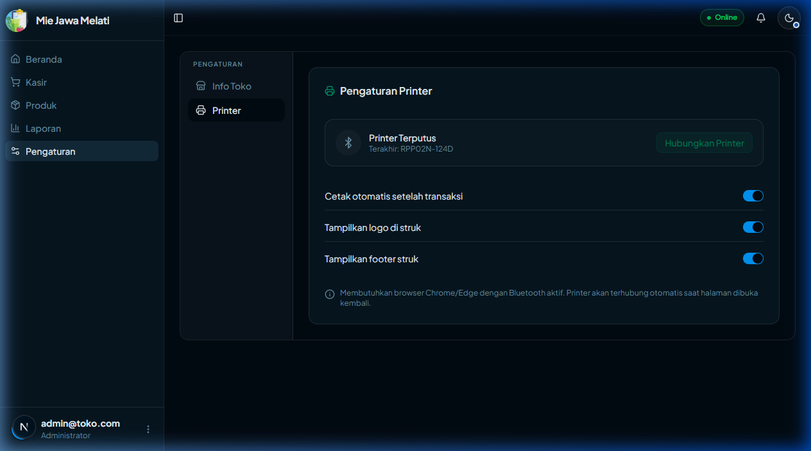
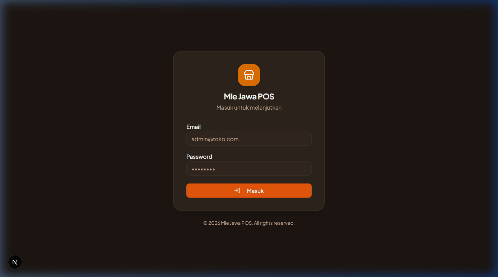

# BAB IV — HASIL DAN PEMBAHASAN

## 4.x Implementasi Antarmuka Pengguna

Bagian ini memaparkan implementasi antarmuka pengguna (*user interface*) dari Sistem *Point of Sale* (POS) berbasis *Progressive Web Application* (PWA) untuk usaha Mie Jawa Melati. Sistem ini dibangun menggunakan *framework* Next.js versi 16 dengan arsitektur *App Router*, bahasa pemrograman TypeScript, serta antarmuka berbasis komponen yang memanfaatkan pustaka shadcn/ui di atas primitif Radix UI. Seluruh halaman dirancang dengan pendekatan *mobile-first* dan responsif, sehingga dapat digunakan secara optimal baik pada perangkat seluler maupun komputer meja.

Sistem POS ini terdiri dari tujuh halaman utama yang masing-masing mengemban fungsi spesifik dalam mendukung operasional kasir harian: halaman *Login*, halaman Beranda, halaman *Dashboard*, halaman Kasir (*POS*), halaman Produk, halaman Laporan, dan halaman Pengaturan.

---

## 4.x.1 Halaman Login

### Deskripsi Halaman

Halaman *Login* merupakan gerbang utama sistem yang berfungsi sebagai mekanisme autentikasi pengguna sebelum dapat mengakses seluruh fitur aplikasi. Halaman ini mengimplementasikan pola keamanan berlapis (*layered security*): lapisan pertama berupa *middleware* server-side yang berjalan pada setiap permintaan HTTP untuk memvalidasi sesi Supabase Auth, dan lapisan kedua berupa *auth guard* sisi klien pada komponen `AppLayout` yang mencegah akses ke halaman yang dilindungi.

Apabila pengguna belum memiliki sesi yang valid, sistem secara otomatis mengalihkan (*redirect*) pengguna ke halaman ini tanpa mengekspos konten yang dilindungi. Sebaliknya, jika sesi yang valid terdeteksi, sistem mengalihkan pengguna langsung ke halaman Beranda (`/`).

### Komponen Antarmuka

Halaman *Login* tersusun atas komponen-komponen berikut:

1. **Identitas Merek** (*Brand Identity*): Ikon toko (`Store`) dari pustaka Lucide React yang ditampilkan dalam area berlatar belakang warna amber dengan sudut melengkung, beserta teks judul aplikasi "Mie Jawa POS" dan teks panduan "Masuk untuk melanjutkan".

2. **Formulir Autentikasi** (*Login Form*): Komponen `LoginForm` yang dibungkus dalam React `<Suspense>` untuk mencegah kesalahan hidrasi (*hydration error*) pada perangkat yang menggunakan *URL search params*. Formulir ini terdiri atas:
   - Bidang masukan email (tipe `text`)
   - Bidang masukan kata sandi (tipe `password`, karakter tersembunyi)
   - Tombol aksi "Masuk" yang memiliki kondisi *loading* saat proses autentikasi berlangsung

3. **Catatan Hak Cipta** (*Copyright Footer*): Teks hak cipta dinamis yang secara otomatis memperbarui tahun menggunakan `new Date().getFullYear()`.

### Alur Penggunaan

Alur penggunaan halaman *Login* dapat diuraikan sebagai berikut. Pengguna membuka URL aplikasi, kemudian *middleware* server-side memvalidasi keberadaan sesi Supabase. Jika sesi tidak valid, pengguna diarahkan ke halaman `/login`. Pengguna mengisi alamat surel dan kata sandi, lalu menekan tombol "Masuk". Sistem mengirimkan kredensial ke Supabase Auth untuk divalidasi. Apabila kredensial benar, sesi baru dibuat dan pengguna diarahkan ke halaman Beranda. Apabila kredensial salah, pesan kesalahan (*error message*) ditampilkan secara langsung tanpa perlu memuat ulang halaman.

### Tampilan Antarmuka

Gambar 4.x.1 menampilkan antarmuka halaman *Login* pada tema gelap (*dark mode*), menunjukkan formulir autentikasi dengan bidang masukan surel dan kata sandi, serta tombol "Masuk" yang menonjol.

---

## 4.x.2 Halaman Beranda

### Deskripsi Halaman

Halaman Beranda merupakan halaman utama yang ditampilkan pertama kali setelah pengguna berhasil melakukan autentikasi. Halaman ini dirancang sebagai *command center* bagi operator kasir: menyajikan informasi ringkas kondisi bisnis terkini dan menyediakan akses cepat (*quick access*) menuju seluruh fitur utama sistem. Pendekatan desain yang digunakan mengutamakan efisiensi operasional, di mana fungsi terpenting (memulai kasir) ditempatkan pada posisi yang paling mudah dijangkau dengan kontras visual yang paling tinggi.

### Komponen Antarmuka

Halaman Beranda terdiri atas tiga komponen utama yang dirangkai dalam satu tata letak kolom:

1. **Spanduk Sambutan** (*Greeting Banner* — komponen `GreetingBanner`):

   Spanduk ini menampilkan sapaan kontekstual yang disesuaikan dengan waktu saat ini menggunakan algoritma pendeteksi rentang jam: "Selamat Pagi" (pukul 05:00–11:59), "Selamat Siang" (pukul 12:00–14:59), "Selamat Sore" (pukul 15:00–18:59), dan "Selamat Malam" (pukul 19:00–04:59). Nama toko ditampilkan secara dinamis dengan mengambil data dari API `store.getProfile` melalui tRPC. Waktu dan tanggal diperbarui otomatis setiap 60 detik menggunakan `setInterval` dengan format "Hari, DD Bulan YYYY · HH:MM WIB" dalam Bahasa Indonesia. Komponen ini juga menampilkan indikator status koneksi jaringan secara *real-time* melalui pemantauan *event* `window.online` dan `window.offline`, yang ditampilkan sebagai lencana (*badge*) "Online" atau "Offline".

2. **Statistik Ringkas** (*Mini Statistics* — komponen `MiniStats`):

   Dua kartu statistik yang menampilkan data bisnis hari berjalan secara *real-time*: "Omzet Hari Ini" (total pendapatan diformat dalam Rupiah menggunakan fungsi `formatRupiah`) dan "Total Transaksi" (jumlah nota yang telah selesai). Data diambil dari *hook* `useDashboardStats` yang terhubung ke Supabase. Selama data dimuat, komponen menampilkan animasi *skeleton* sebagai penanda pemuatan.

3. **Grid Aksi Cepat** (*Quick Action Grid* — komponen `QuickActionGrid`):

   Empat kartu navigasi yang tersusun dalam tata letak kolom dengan hierarki visual yang jelas:
   - **"Mulai Kasir"** (varian *primary*, tampil dominan dengan warna tema) → navigasi ke `/pos`
   - **"Kelola Produk"** (varian *secondary*) → navigasi ke `/products`
   - **"Lihat Laporan"** (varian *secondary*) → navigasi ke `/reports`
   - **"Dashboard"** (varian *secondary*) → navigasi ke `/dashboard`

   Setiap kartu memiliki ikon, label, deskripsi singkat, dan animasi *hover* berupa pergeseran naik (`-translate-y-0.5`) dan peningkatan bayangan (*shadow*) untuk memberikan umpan balik interaktif.

### Alur Penggunaan

Setelah autentikasi berhasil, pengguna diarahkan ke Beranda. Pengguna dapat langsung melihat ringkasan omzet dan jumlah transaksi hari ini tanpa perlu berpindah halaman. Untuk memulai transaksi, pengguna dapat langsung menekan kartu "Mulai Kasir" yang tampil paling menonjol. Selain itu, pengguna dapat berpindah ke fitur lain melalui kartu navigasi lainnya atau melalui *sidebar* navigasi utama aplikasi.

### Tampilan Antarmuka

Gambar 4.x.2 menampilkan antarmuka halaman Beranda yang menunjukkan spanduk sambutan dinamis, dua kartu statistik harian, dan empat kartu aksi cepat.

---

## 4.x.3 Halaman Dashboard

### Deskripsi Halaman

Halaman *Dashboard* merupakan pusat analitik bisnis yang menyajikan statistik penjualan secara komprehensif dan visual. Halaman ini diperuntukkan bagi pemilik toko untuk memantau performa bisnis, mengidentifikasi tren pendapatan historis, dan mengetahui produk-produk yang paling diminati pelanggan. Salah satu fitur unggulan halaman ini adalah pembaruan data *real-time* menggunakan Supabase Realtime Listener melalui *hook* `useLiveStats`, sehingga setiap transaksi baru yang masuk akan langsung terefleksi pada statistik yang ditampilkan tanpa perlu me-*refresh* halaman secara manual.

### Komponen Antarmuka

Halaman *Dashboard* tersusun atas tiga kelompok komponen:

1. **Kartu Indikator Kinerja Utama** (*KPI Cards*):

   Empat kartu statistik yang menampilkan data kinerja bisnis pada hari berjalan:
   - **Omzet Hari Ini**: Total pendapatan dari seluruh transaksi yang telah selesai pada hari berjalan, ditampilkan dalam format Rupiah menggunakan ikon dompet (*Wallet*) berwarna amber.
   - **Total Transaksi**: Jumlah nota atau transaksi yang berhasil diproses pada hari ini, ditampilkan dengan ikon tanda terima (*Receipt*) berwarna hijau zamrud (*emerald*).
   - **Rata-rata per Transaksi**: Nilai rata-rata setiap transaksi yang dihitung dari perbandingan total omzet dengan jumlah transaksi, ditampilkan dengan ikon bagan (*BarChart2*) berwarna biru.
   - **Menu Terlaris**: Nama menu dengan jumlah porsi terjual terbanyak pada hari ini beserta keterangan jumlah porsi, ditampilkan dengan ikon bintang (*Star*) berwarna oranye.

2. **Grafik Pendapatan** (*Revenue Chart* — komponen `RevenueChart`):

   Visualisasi data pendapatan dalam bentuk *bar chart* (grafik batang) dengan filter periode waktu yang dapat dipilih pengguna: 7 Hari Terakhir, 14 Hari Terakhir, atau 30 Hari Terakhir. Sumbu horizontal menampilkan nama hari (Min–Sab) dan sumbu vertikal menampilkan nilai pendapatan dengan satuan "k" untuk ribuan Rupiah.

3. **Tabel Produk Teratas** (*Top Products* — komponen `TopProducts`):

   Daftar produk dengan penjualan tertinggi pada periode yang sedang aktif, menampilkan nama produk, jumlah porsi terjual, dan total pendapatan yang dihasilkan dari produk tersebut.

### Alur Penggunaan

Pengguna membuka halaman *Dashboard* melalui *sidebar* navigasi atau kartu aksi cepat di Beranda. Data KPI dimuat secara otomatis dan diperbarui *real-time* via Supabase Realtime. Pengguna dapat mengubah filter periode grafik (7/14/30 hari) untuk melihat tren historis pendapatan. Seluruh data pada halaman ini bersifat hanya-baca (*read-only*) dan tidak memerlukan interaksi lebih lanjut selain pemilihan filter.

### Tampilan Antarmuka

Gambar 4.x.3 menampilkan antarmuka halaman *Dashboard* dengan empat kartu KPI, grafik batang pendapatan 7 hari terakhir, dan tabel produk terlaris.

---

## 4.x.4 Halaman Kasir (POS)

### Deskripsi Halaman

Halaman Kasir merupakan komponen inti dari sistem POS yang digunakan untuk memproses seluruh transaksi penjualan. Fungsi utamanya meliputi pemilihan produk dari katalog, penyesuaian kuantitas, penambahan catatan khusus per item, proses pembayaran dengan berbagai metode, hingga pencetakan struk melalui printer Bluetooth. Halaman ini mengimplementasikan desain responsif dengan tata letak berbeda untuk kondisi desktop (dua kolom) dan kondisi *mobile* (satu kolom dengan tombol keranjang melayang).

Halaman ini juga mendukung operasi *offline*: apabila transaksi dilakukan dalam kondisi perangkat tidak terhubung ke internet, data transaksi disimpan sementara di penyimpanan lokal (*localStorage*) dan akan disinkronisasi secara otomatis ke server Supabase begitu koneksi internet pulih, menggunakan *hook* `useSyncTransaction`.

### Komponen Antarmuka

1. **Katalog Produk** (*Product Catalog* — komponen `ProductCatalog`):

   Sisi kiri halaman (pada desktop) yang menampilkan seluruh produk yang tersedia dalam tata letak *grid*. Di bagian atas terdapat baris tombol filter kategori berbentuk *pill* yang memungkinkan pengguna menyaring tampilan produk berdasarkan kategori (seperti Makanan, Minuman, Tambahan). Setiap kartu produk menampilkan nama produk, harga satuan, dan tombol penambah ke keranjang. Saat data produk sedang dimuat, komponen menampilkan animasi *skeleton* sebagai indikator pemuatan.

2. **Panel Keranjang Belanja** (*Cart Panel* — komponen `CartPanel`):

   Panel yang ditampilkan di sisi kanan halaman pada tampilan desktop (lebar 320–384 piksel). Panel ini mencantumkan daftar item yang telah dipilih, masing-masing beserta nama produk, kontrol kuantitas (tombol tambah dan kurang, serta input angka yang dapat diketik langsung oleh kasir), harga satuan, subtotal, dan ikon penanda catatan apabila item memiliki catatan khusus. Di bagian bawah panel ditampilkan total keseluruhan tagihan, tombol "Kosongkan Keranjang" (dilengkapi dialog konfirmasi *AlertDialog*), dan tombol "Bayar" untuk melanjutkan ke proses pembayaran.

3. **Tombol Keranjang Melayang** (*Floating Cart Button*):

   Pada tampilan *mobile*, panel keranjang tidak ditampilkan langsung. Sebagai gantinya, sebuah tombol melayang (*fixed position*) muncul di bagian bawah layar saat keranjang tidak kosong, menampilkan informasi ringkas: jumlah item, total tagihan, dan penanda "Ada Catatan" apabila terdapat item bernotasi. Tombol ini menggunakan animasi masuk (`slide-in-from-bottom`).

4. **Modal Catatan Item** (*Note Modal* — komponen `NoteModal`):

   Dialog yang dapat dibuka untuk setiap item di keranjang guna menambahkan instruksi khusus, misalnya "tanpa pedas" atau "ekstra saus". Modal ini juga mendukung fitur *split quantity*, yaitu kemampuan memecah satu item menjadi dua entri terpisah dengan catatan yang berbeda (misalnya, 2 porsi mie: 1 dengan catatan "tidak pedas" dan 1 dengan catatan "ekstra pedas").

5. **Modal Pembayaran** (*Checkout Modal* — komponen `CheckoutModal`):

   Dialog yang muncul saat pengguna menekan tombol "Bayar", menampilkan ringkasan lengkap pesanan. Pengguna memilih metode pembayaran dari tiga opsi yang tersedia: Tunai (*CASH*), QRIS, atau Transfer Bank. Untuk pembayaran tunai, terdapat bidang masukan nominal uang yang diterima, dan kalkulasi kembalian dilakukan secara otomatis *real-time*. Kuantitas item dapat diedit ulang di dalam modal ini sebelum transaksi diproses.

6. **Modal Struk** (*Receipt Modal* — komponen `ReceiptModal`):

   Dialog yang ditampilkan setelah transaksi berhasil diproses, berisi struk digital lengkap mencakup nama toko, logo, daftar item beserta kuantitas dan subtotal, total tagihan, metode pembayaran, nominal yang dibayarkan, kembalian, nomor invoice, serta cap waktu transaksi. Tersedia tombol untuk mencetak struk secara langsung ke printer Bluetooth menggunakan Web Bluetooth API yang didukung browser Chrome dan Edge.

### Alur Penggunaan

Kasir membuka halaman `/pos`. Sistem memuat daftar produk dari server dan menampilkan katalog. Kasir memilih kategori produk (opsional) untuk menyaring tampilan, kemudian menekan kartu produk untuk menambahkannya ke keranjang. Jika diperlukan, kasir menambahkan catatan khusus per item melalui Modal Catatan. Setelah seluruh pesanan dimasukkan, kasir menekan tombol "Bayar" untuk membuka Modal Pembayaran, memilih metode bayar, memasukkan nominal (jika tunai), lalu menekan "Proses". Sistem menyimpan transaksi ke Supabase (atau ke antrean lokal jika *offline*), kemudian Modal Struk ditampilkan. Kasir dapat mencetak struk melalui printer Bluetooth, lalu menekan "Selesai" untuk mengosongkan keranjang dan bersiap memproses transaksi berikutnya.

### Tampilan Antarmuka

Gambar 4.x.4 menampilkan antarmuka halaman Kasir dengan katalog produk, filter kategori, dan panel keranjang belanja pada tampilan desktop.

---

## 4.x.5 Halaman Manajemen Produk

### Deskripsi Halaman

Halaman Manajemen Produk menyediakan antarmuka administrasi untuk mengelola seluruh katalog menu yang tersedia pada sistem kasir. Melalui halaman ini, administrator atau pemilik toko dapat menambahkan produk baru, mengubah informasi produk yang sudah ada (nama, harga, kategori, dan gambar), menghapus produk yang tidak lagi dijual, serta mengelola kategori produk secara terpisah. Setiap perubahan yang dilakukan akan langsung terefleksi pada halaman Kasir tanpa perlu memuat ulang aplikasi.

### Komponen Antarmuka

1. **Kepala Halaman dan Bilah Alat** (*Header & Toolbar*):

   Bagian atas halaman menampilkan judul "Manajemen Produk" beserta deskripsi singkat fungsi halaman dan informasi jumlah produk aktif. Bilah alat (*toolbar*) berisi tiga elemen utama: tombol "Kelola Kategori" untuk membuka modal manajemen kategori, tombol "Tambah Produk" untuk membuka formulir produk baru, dan bidang masukan pencarian (*search bar*) untuk memfilter daftar produk secara *real-time* berdasarkan nama.

2. **Tabel Produk** (*Product Table* — komponen `ProductTable`):

   Tabel yang menampilkan seluruh produk dalam kolom-kolom berikut: Nama Produk, Harga (diformat dalam Rupiah), dan Aksi. Kolom Aksi berisi dua ikon interaktif: ikon pensil untuk membuka formulir pengeditan dan ikon tempat sampah untuk menghapus produk (disertai konfirmasi sebelum penghapusan dilakukan).

3. **Modal Formulir Produk** (*Product Form Modal* — komponen `ProductFormModal`):

   Dialog yang digunakan baik untuk menambah produk baru maupun mengedit produk yang ada. Formulir ini terdiri atas bidang-bidang: Nama Produk (wajib diisi), Harga (wajib diisi, diformat sebagai angka), Kategori (dipilih dari *dropdown* daftar kategori aktif), dan Gambar Produk (opsional, diunggah ke Supabase Storage). Validasi data formulir dilakukan menggunakan skema Zod untuk memastikan integritas data sebelum dikirimkan ke server.

4. **Modal Manajemen Kategori** (*Category Manager Modal* — komponen `CategoryManagerModal`):

   Dialog khusus untuk mengelola kategori produk secara terpisah dari pengelolaan produk itu sendiri. Pengguna dapat menambahkan kategori baru, mengubah nama kategori yang sudah ada, atau menghapus kategori yang tidak lagi digunakan. Perubahan kategori akan langsung memperbarui daftar filter kategori pada halaman Kasir.

### Alur Penggunaan

Pengguna membuka halaman `/products`. Daftar seluruh produk yang terdaftar ditampilkan dalam tabel. Untuk menambah produk baru, pengguna menekan tombol "Tambah Produk", mengisi formulir yang muncul, lalu menekan "Simpan". Untuk mengubah data produk, pengguna menekan ikon pensil pada baris produk yang diinginkan, mengubah data pada formulir, lalu menekan "Simpan". Untuk menghapus produk, pengguna menekan ikon tempat sampah, mengonfirmasi penghapusan pada dialog konfirmasi yang muncul. Pengelolaan kategori dilakukan melalui tombol "Kelola Kategori" yang membuka modal manajemen kategori secara terpisah.

### Tampilan Antarmuka

Gambar 4.x.5 menampilkan antarmuka halaman Manajemen Produk dengan tabel daftar produk, bilah alat pencarian, dan tombol aksi.

---

## 4.x.6 Halaman Laporan Penjualan

### Deskripsi Halaman

Halaman Laporan Penjualan menyajikan rekapitulasi riwayat seluruh transaksi yang telah dilakukan, lengkap dengan kemampuan penyaringan (*filtering*) multidimensi. Halaman ini dirancang untuk memenuhi kebutuhan analisis penjualan dan pembukuan, memungkinkan pengguna untuk melihat ringkasan kinerja pada periode tertentu, mencari nota transaksi spesifik, dan mengekspor data ke format berkas CSV (*Comma-Separated Values*) untuk keperluan pengolahan lebih lanjut menggunakan perangkat lunak *spreadsheet*.

### Komponen Antarmuka

1. **Panel Filter** (*Report Filter Bar* — komponen `ReportFilterBar`):

   Bilah filter yang tersusun secara horizontal (atau vertikal pada perangkat *mobile*) dengan lima elemen penyaring yang dapat dikombinasikan secara bebas:
   - **Pencarian Nomor Nota**: Input teks bebas untuk mencari transaksi berdasarkan nomor invoice.
   - **Jumlah Baris per Halaman**: *Dropdown* untuk memilih jumlah data yang ditampilkan per halaman: 10, 25, 50, atau 100 baris.
   - **Metode Pembayaran**: *Dropdown* untuk menyaring berdasarkan metode pembayaran: Semua Metode, Tunai (*CASH*), QRIS, atau Transfer Bank.
   - **Tanggal Mulai**: Pemilih tanggal (*date picker*) untuk menentukan batas awal periode laporan.
   - **Tanggal Akhir**: Pemilih tanggal untuk menentukan batas akhir periode laporan.

2. **Kartu Ringkasan Statistik** (*Report Stats Cards* — komponen `ReportStatsCards`):

   Tiga kartu yang menampilkan statistik agregat yang merespons secara dinamis terhadap filter yang sedang aktif:
   - **Total Pendapatan**: Akumulasi seluruh nilai transaksi pada periode yang dipilih.
   - **Jumlah Transaksi**: Total nota yang terdaftar dalam periode yang dipilih.
   - **Rata-rata per Transaksi**: Rata-rata nilai setiap transaksi pada periode tersebut.

   Keterangan periode ditampilkan di bawah setiap kartu: "Periode terpilih" apabila filter tanggal aktif, atau "Semua waktu" apabila tidak ada filter tanggal.

3. **Tabel Riwayat Transaksi** (*Transaction Table* — komponen `TransactionTable`):

   Tabel paginasi yang menampilkan daftar transaksi dengan kolom-kolom: Nomor Nota/Invoice, Waktu, Jumlah Item, Metode Pembayaran, dan Total. Setiap kolom dapat diurutkan (*sortable*) dengan menekan kepala kolom. Pengguna dapat menekan baris transaksi untuk membuka detail transaksi.

4. **Modal Detail Transaksi** (*Transaction Detail Modal* — komponen `TransactionDetailModal`):

   Dialog yang menampilkan informasi lengkap satu transaksi: nomor invoice, cap waktu, daftar item yang dipesan beserta kuantitas, harga satuan, dan subtotal masing-masing item, total pembayaran, metode bayar yang digunakan, jumlah yang dibayarkan, serta kembalian.

5. **Navigasi Halaman** (*Pagination* — komponen `ReportPagination`):

   Komponen navigasi di bagian bawah tabel yang menampilkan informasi "Menampilkan X–Y dari Z transaksi" beserta tombol-tombol navigasi halaman (pertama, sebelumnya, berikutnya, terakhir).

6. **Ekspor CSV**:

   Tombol "Export CSV" di bagian atas halaman yang mengunduh seluruh data transaksi sesuai filter yang aktif dalam format berkas `.csv`, siap diimpor ke aplikasi pengolah lembar kerja (*spreadsheet*) seperti Microsoft Excel atau Google Sheets.

### Alur Penggunaan

Pengguna membuka halaman `/reports`. Secara *default*, sistem menampilkan transaksi hari ini. Pengguna dapat menyempurnakan tampilan dengan mengombinasikan filter yang tersedia (pencarian nomor nota, metode bayar, rentang tanggal, dan jumlah baris). Kartu statistik memperbarui nilainya secara otomatis setiap kali filter diubah. Pengguna dapat menekan baris transaksi untuk melihat detail lengkapnya pada modal yang muncul. Untuk keperluan pembukuan, pengguna dapat mengunduh data yang sedang ditampilkan (sesuai filter aktif) ke berkas CSV dengan menekan tombol "Export CSV".

### Tampilan Antarmuka

Gambar 4.x.6 menampilkan antarmuka halaman Laporan Penjualan dengan panel filter, tiga kartu statistik, dan tabel riwayat transaksi.

---

## 4.x.7 Halaman Pengaturan Toko

### Deskripsi Halaman

Halaman Pengaturan merupakan pusat konfigurasi sistem yang memungkinkan pemilik toko untuk mengubah informasi identitas toko serta mengelola perangkat printer *thermal* Bluetooth untuk mencetak struk transaksi. Halaman ini menggunakan desain navigasi yang adaptif: pada perangkat *mobile* ditampilkan sebagai *tab pill* horizontal, sedangkan pada layar desktop ditampilkan sebagai *sidebar* vertikal di sisi kiri.

### Komponen Antarmuka

**Tab 1 — Info Toko** (komponen `StoreSettingsForm`):

Formulir konfigurasi informasi identitas toko yang terdiri atas:
- **Logo Toko**: Komponen *upload* gambar dengan pratinjau (*preview*) langsung yang ditampilkan setelah berkas dipilih. Gambar diunggah ke Supabase Storage. Logo ini digunakan pada struk cetak transaksi. Format yang direkomendasikan adalah persegi (rasio 1:1) dengan ukuran berkas maksimal 5 MB.
- **Nama Toko**: Bidang masukan teks untuk nama usaha (nilai *default*: "Mie Jawa Melati").
- **Alamat Toko**: Bidang masukan teks untuk alamat lengkap toko.
- **Nomor Telepon**: Bidang masukan teks untuk nomor kontak toko.
- **Tombol "Simpan Perubahan"**: Menyimpan seluruh perubahan ke basis data melalui mutasi tRPC, disertai notifikasi *toast* yang menginformasikan keberhasilan atau kegagalan penyimpanan.

**Tab 2 — Printer** (komponen `PrinterSettingsCard`):

Panel konfigurasi printer *thermal* Bluetooth yang terdiri atas:
- **Indikator Status Koneksi**: Menampilkan tiga kondisi berbeda:
  - *Terhubung*: Ikon `BluetoothConnected` berwarna hijau zamrud beserta nama perangkat printer.
  - *Menghubungkan ulang*: Ikon `Loader2` dengan animasi berputar berwarna amber, beserta teks "Mencoba terhubung ke printer terakhir".
  - *Terputus*: Ikon `Bluetooth` berwarna abu-abu beserta nama printer terakhir yang tersimpan (jika ada).
- **Tombol Aksi Koneksi**:
  - "Hubungkan Printer": Membuka dialog pemilihan perangkat Bluetooth bawaan browser (untuk pengguna pertama kali atau mengganti printer).
  - "Putuskan": Memutus koneksi printer yang sedang aktif.
- **Preferensi Cetak**: Tiga *toggle switch* yang dapat diaktifkan atau dinonaktifkan secara independen:
  - Cetak otomatis setelah transaksi selesai
  - Tampilkan logo toko di struk
  - Tampilkan teks *footer* di bagian bawah struk
- **Catatan Teknis**: Keterangan bahwa fitur ini membutuhkan peramban (*browser*) Chrome atau Edge dengan Bluetooth aktif. Fitur koneksi ulang otomatis (*auto-reconnect*) menggunakan API `navigator.bluetooth.getDevices()` untuk menyambung kembali ke printer yang sebelumnya telah dipasangkan (*paired*), tanpa perlu memilih ulang perangkat setiap kali halaman dibuka.

### Alur Penggunaan

Pengguna membuka halaman `/settings`. Tab "Info Toko" aktif secara *default*. Untuk mengubah informasi toko, pengguna mengisi atau mengubah bidang-bidang yang tersedia, lalu menekan "Simpan Perubahan". Untuk mengelola printer, pengguna berpindah ke tab "Printer". Jika printer belum pernah dihubungkan, pengguna menekan "Hubungkan Printer" dan memilih perangkat dari dialog Bluetooth yang muncul. Jika printer telah terhubung sebelumnya, sistem akan mencoba menghubungkan ulang secara otomatis saat halaman dibuka. Pengguna dapat menyesuaikan preferensi cetak melalui *toggle switch* yang tersedia.

### Tampilan Antarmuka

Gambar 4.x.7a menampilkan Tab Info Toko dan Gambar 4.x.7b menampilkan Tab Printer pada halaman Pengaturan.

---

## 4.x.8 Komponen Menu Akun

### Deskripsi Komponen

Menu Akun merupakan komponen *popup* yang dapat diakses melalui ikon akun pada bilah navigasi bawah (*bottom navigation bar*) aplikasi. Komponen ini berfungsi sebagai titik akses terpusat untuk fungsi-fungsi yang berkaitan dengan akun pengguna yang sedang aktif.

### Konten Menu Akun

Menu Akun menampilkan informasi identitas pengguna: avatar berupa inisial huruf pertama surel pengguna, alamat surel lengkap, dan peran pengguna ("Administrator"). Tersedia tiga aksi yang dapat dilakukan:
- **"Edit Profil"**: Membuka `AccountProfileForm` dalam dialog modal untuk mengubah nama tampilan dan foto profil pengguna.
- **"Pengaturan Toko"**: Navigasi langsung ke halaman `/settings`.
- **"Keluar"**: Menjalankan proses *logout* Supabase Auth, menghapus sesi pengguna, dan mengalihkan ke halaman `/login`.

### Tampilan Antarmuka

Gambar 4.x.8 menampilkan komponen Menu Akun yang terbuka, menampilkan informasi identitas pengguna dan pilihan aksi yang tersedia.

---

## 4.x.9 Ringkasan Implementasi

Tabel 4.x.9 menyajikan ringkasan seluruh halaman yang telah diimplementasikan beserta teknologi utama dan fitur khas masing-masing halaman.

| No | Halaman | URL | Fitur Utama | Teknologi Kunci |
|----|---------|-----|-------------|-----------------|
| 1 | Login | `/login` | Autentikasi berlapis (server + client), redirect otomatis | Supabase Auth, Next.js Middleware |
| 2 | Beranda | `/` | Sapaan dinamis, statistik hari ini, navigasi cepat | tRPC, `useDashboardStats`, `setInterval` |
| 3 | Dashboard | `/dashboard` | 4 KPI card, grafik bar, top produk, realtime | Supabase Realtime, `useLiveStats` |
| 4 | Kasir (POS) | `/pos` | Katalog produk, keranjang, catatan, checkout, struk | Web Bluetooth API, `useSyncTransaction`, offline queue |
| 5 | Produk | `/products` | CRUD produk, manajemen kategori, upload gambar | tRPC mutations, Supabase Storage, Zod |
| 6 | Laporan | `/reports` | Filter multidimensi, pagination, detail transaksi, ekspor CSV | tRPC queries, `useReportFilters` |
| 7 | Pengaturan | `/settings` | Info toko, printer Bluetooth, auto-reconnect | Web Bluetooth API, `navigator.bluetooth.getDevices()` |

*Tabel 4.x.9 – Ringkasan Implementasi Halaman Sistem POS Mie Jawa Melati*
