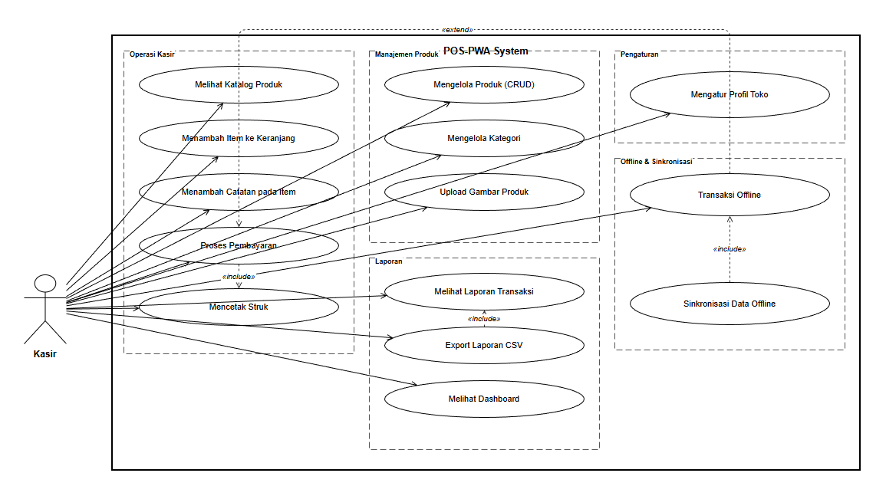
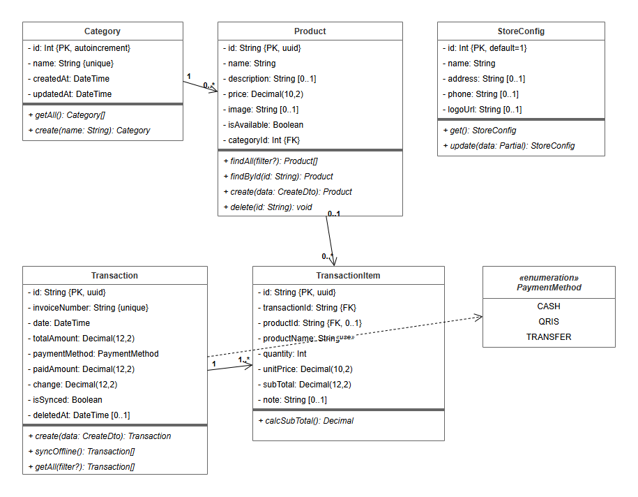
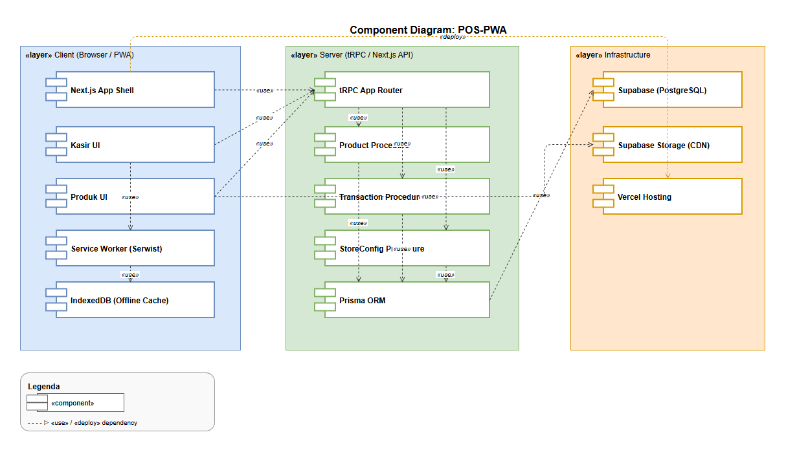
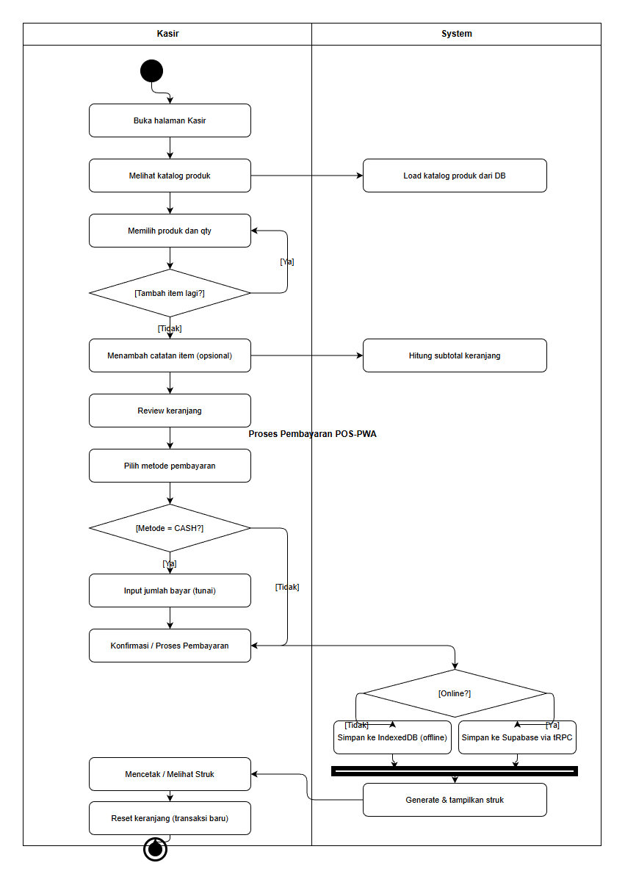
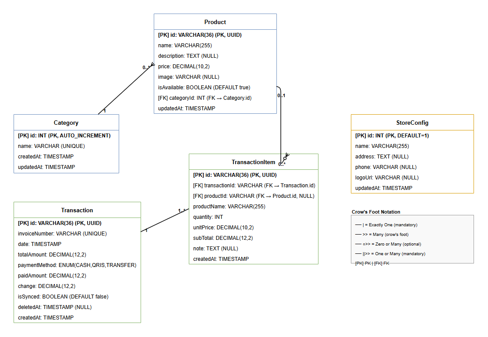
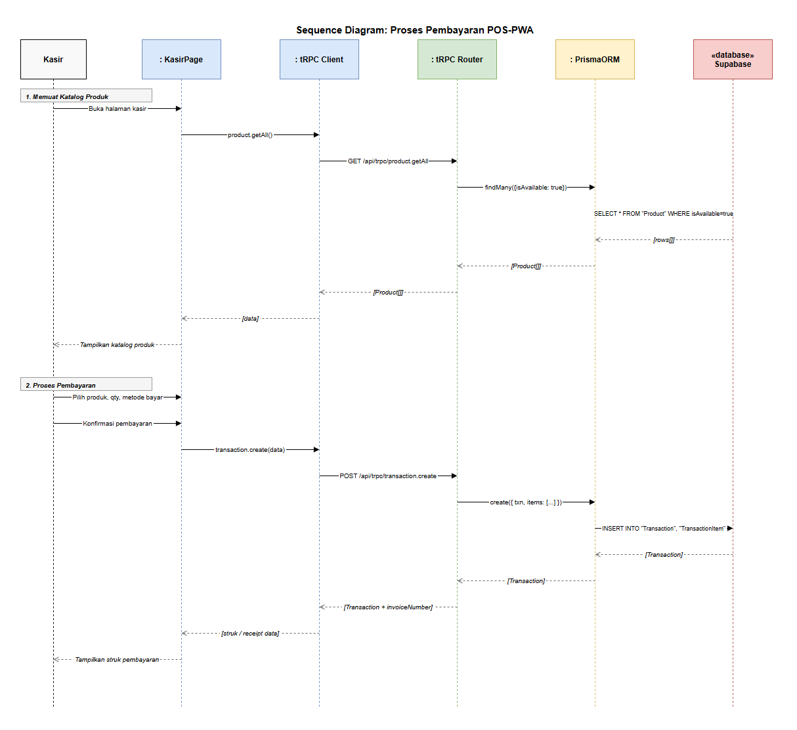
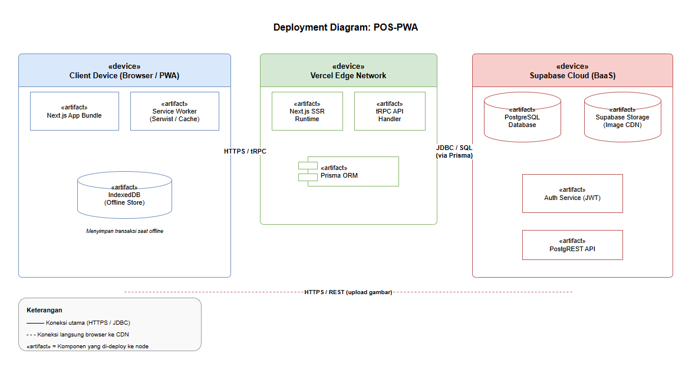

# UML Documentation — POS-PWA

> **Standar:** UML 2.x (Object Management Group) + Crow's Foot notation (ERD)
> **Tool:** draw.io Desktop · **Format:** XML + PNG export
> **Terakhir diperbarui:** April 2026

---

## Daftar Diagram

| # | Diagram | File | Keterangan |
|---|---------|------|------------|
| 1 | Use Case | [`uml-usecase.drawio`](diagrams/uml-usecase.drawio) | Interaksi Kasir dengan sistem |
| 2 | Class | [`uml-class.drawio`](diagrams/uml-class.drawio) | Model domain & relasi OOP |
| 3 | Component | [`uml-component.drawio`](diagrams/uml-component.drawio) | Arsitektur komponen teknikal |
| 4 | Activity | [`uml-activity.drawio`](diagrams/uml-activity.drawio) | Alur proses transaksi |
| 5 | ERD | [`erd.drawio`](diagrams/erd.drawio) | Skema database (Crow's Foot) |
| 6 | Sequence | [`uml-sequence.drawio`](diagrams/uml-sequence.drawio) | Alur pembayaran end-to-end |
| 7 | Deployment | [`uml-deployment.drawio`](diagrams/uml-deployment.drawio) | Arsitektur fisik (Client → Vercel → Supabase) |

---

## 1. Use Case Diagram



**Aktor:** Kasir  
**System Boundary:** POS-PWA System  
**Use Cases:** 14 use case, dikelompokkan dalam 4 subsistem:
- Operasi Kasir (transaksi harian)
- Manajemen Produk (CRUD + upload)
- Laporan (dashboard, CSV export)
- Offline & Sinkronisasi

**Relasi:**
- `«include»` — Proses Pembayaran → Mencetak Struk; Melihat Laporan → Export CSV
- `«extend»` — Sinkronisasi Data Offline → Transaksi Offline

---

## 2. Class Diagram



**Kelas:** `Category`, `Product`, `Transaction`, `TransactionItem`, `StoreConfig`  
**Enumerasi:** `PaymentMethod` (CASH | QRIS | TRANSFER)

**Relasi UML 2.x:**
| Relasi | Dari | Ke | Notasi |
|--------|------|----|--------|
| Composition (◆) | `Transaction` | `TransactionItem` | 1..* |
| Composition (◆) | `Category` | `Product` | 0..* |
| Dependency (→) | `Transaction` | `PaymentMethod` | use |
| Association | `TransactionItem` | `Product` | 0..1 |

---

## 3. Component Diagram



**Lapisan arsitektur:**
- `«layer» Client` — Next.js App Shell, Kasir UI, Produk UI, Service Worker (Serwist), IndexedDB
- `«layer» Server` — tRPC App Router, Product/Transaction/StoreConfig Procedure, Prisma ORM
- `«layer» Infrastructure` — Supabase (PostgreSQL), Supabase Storage (CDN), Vercel Hosting

**Semua ketergantungan** menggunakan stereotype `«use»` atau `«deploy»` (UML 2.x §9.6).

---

## 4. Activity Diagram



**Alur:** Proses transaksi kasir dari buka halaman hingga struk dicetak.  
**Swimlane:** Kasir | System  
**Notasi UML 2.x:**
- ● Initial Node (solid black circle)
- ◉ Activity Final Node (bullseye)
- ◇ Decision Node (guard conditions dalam `[...]`)
- Fork/Join Bar untuk alur paralel online/offline

---

## 5. Entity Relationship Diagram (ERD)



**Notasi:** Crow's Foot  
**Sumber kebenaran:** `prisma/schema.prisma`

| Entitas | PK | Relasi |
|---------|-----|--------|
| `Category` | `id INT AUTO_INCREMENT` | 1 → 0..* Product |
| `Product` | `id VARCHAR(36) UUID` | FK ke Category |
| `Transaction` | `id VARCHAR(36) UUID` | 1 → 1..* TransactionItem |
| `TransactionItem` | `id VARCHAR(36) UUID` | FK ke Transaction & Product |
| `StoreConfig` | `id INT DEFAULT=1` | Singleton |

---

## 6. Sequence Diagram



**Skenario:** Proses Pembayaran POS-PWA (dari memuat katalog hingga struk dicetak)

**Lifeline (6):** Kasir → KasirPage → tRPC Client → tRPC Router → PrismaORM → Supabase

**Dua alur utama:**
1. **Memuat Katalog Produk** — `product.getAll()` → `SELECT * FROM Product WHERE isAvailable=true`
2. **Proses Pembayaran** — `transaction.create(data)` → `INSERT INTO Transaction, TransactionItem`

---

## 7. Deployment Diagram



**Arsitektur fisik tiga tier:**

```
Client Device (Browser/PWA)
  ├── «artifact» Next.js App Bundle
  ├── «artifact» Service Worker (Serwist / Cache)
  └── «artifact» IndexedDB (Offline Store)
        │ HTTPS / tRPC
Vercel Edge Network
  ├── «artifact» Next.js SSR Runtime
  ├── «artifact» tRPC API Handler
  └── «artifact» Prisma ORM
        │ JDBC / SQL (via Prisma)
Supabase Cloud (BaaS)
  ├── «artifact» PostgreSQL Database
  ├── «artifact» Supabase Storage (Image CDN)
  ├── «artifact» Auth Service (JWT)
  └── «artifact» PostgREST API
```

**Koneksi tambahan:** Browser → Supabase Storage (HTTPS/REST, upload gambar produk)

---

## Panduan Export PNG

```powershell
# Export semua diagram ke PNG (dari root project)
$drawio = "C:\Program Files\draw.io\draw.io.exe"
Get-ChildItem docs\diagrams\*.drawio | ForEach-Object {
    & $drawio --export --format png --border 30 `
              --output "docs\diagrams\preview\$($_.BaseName).png" `
              $_.FullName
}
```

---

*Dokumentasi ini diperbarui secara otomatis sesuai standar UML 2.x dan Crow's Foot notation untuk keperluan tesis akademik.*
