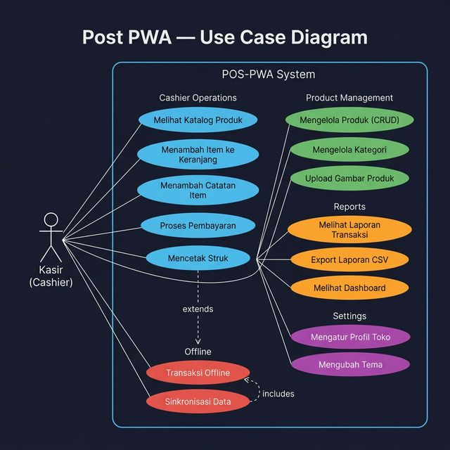
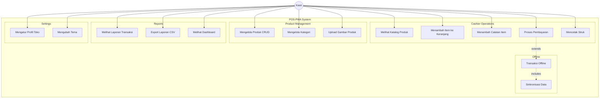
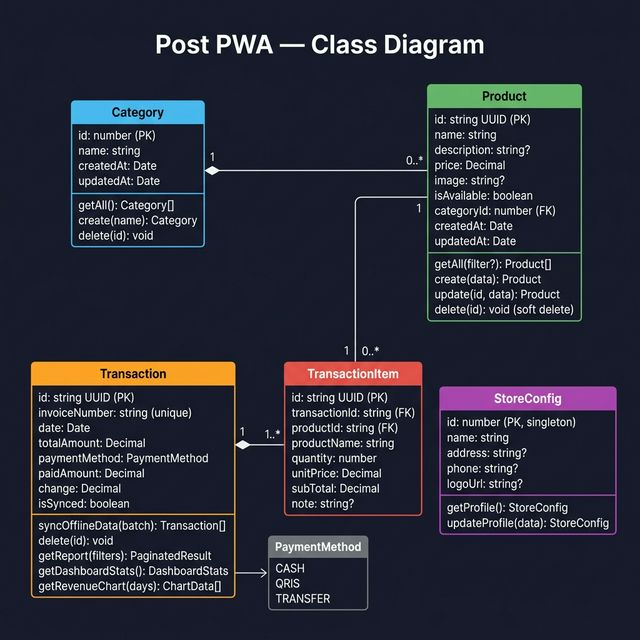
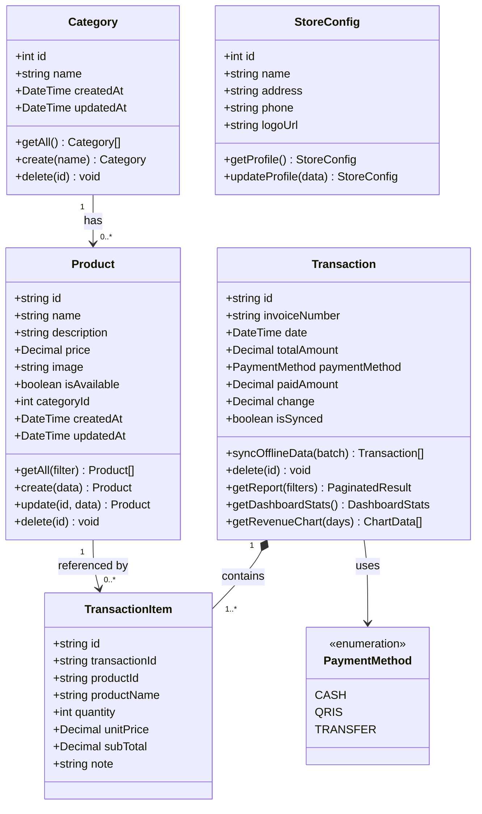
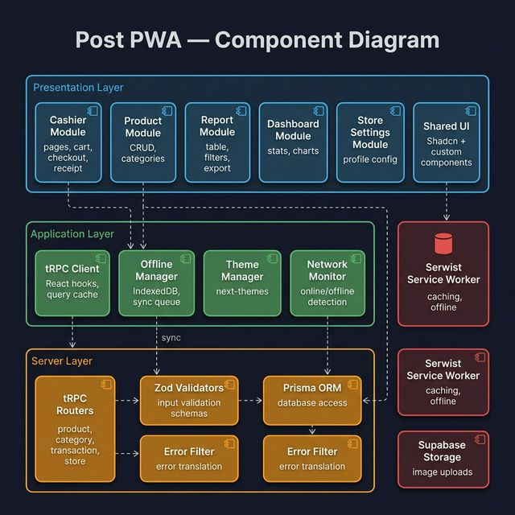
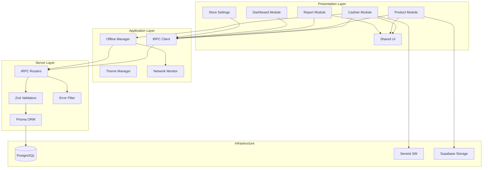
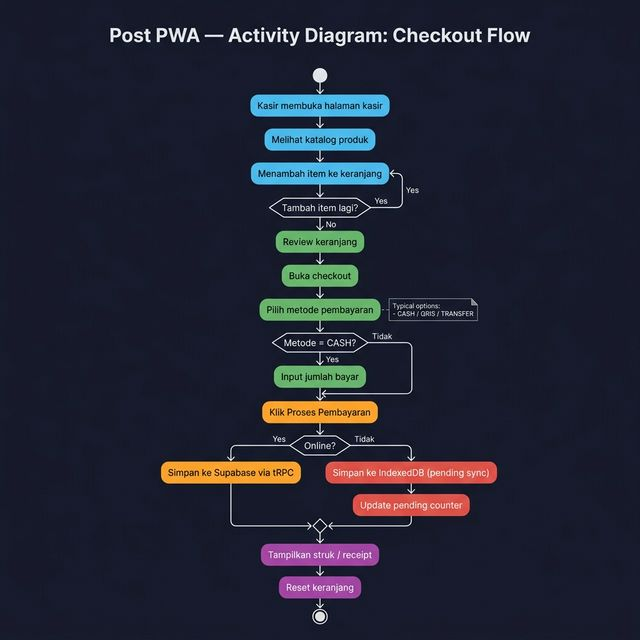
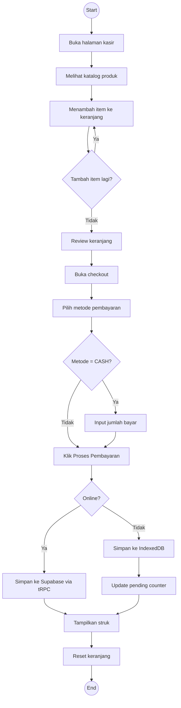

# UML Diagrams — Post PWA

> Comprehensive UML documentation for the POS-PWA system.

---

## 1. Use Case Diagram

Menampilkan interaksi aktor (Kasir) dengan semua fitur yang tersedia di sistem.



<details>
<summary>📝 Mermaid Text Version</summary>



</details>

**Aktor:**
- **Kasir** — Pengguna utama sistem POS

**Use Cases:**

| Grup | Use Case | Deskripsi |
|------|----------|-----------|
| Kasir | Melihat Katalog Produk | Browse produk berdasarkan kategori |
| Kasir | Menambah Item ke Keranjang | Pilih produk dan atur qty |
| Kasir | Menambah Catatan Item | Tambah note khusus per item |
| Kasir | Proses Pembayaran | Checkout dengan metode bayar |
| Kasir | Mencetak Struk | Tampilkan / cetak receipt |
| Produk | Mengelola Produk (CRUD) | Tambah, edit, hapus produk |
| Produk | Mengelola Kategori | Tambah, hapus kategori |
| Produk | Upload Gambar Produk | Upload via Supabase Storage |
| Laporan | Melihat Laporan Transaksi | Report dengan filter & sort |
| Laporan | Export Laporan CSV | Download data transaksi |
| Laporan | Melihat Dashboard | Statistik hari ini & chart |
| Setting | Mengatur Profil Toko | Nama, alamat, logo toko |
| Setting | Mengubah Tema | Light / Dark mode |
| Offline | Transaksi Offline | Checkout tanpa internet |
| Offline | Sinkronisasi Data | Auto-sync saat online |

**Relasi:**
- `Transaksi Offline` **extends** `Proses Pembayaran`
- `Sinkronisasi Data` **includes** `Transaksi Offline`

---

## 2. Class Diagram

Menampilkan struktur data model beserta atribut, method, dan relasi antar class.



<details>
<summary>📝 Mermaid Text Version</summary>



</details>

**Classes:**

| Class | Tipe | Atribut Utama | Method Utama |
|-------|------|--------------|--------------|
| `Category` | Entity | id, name | getAll, create, delete |
| `Product` | Entity | id, name, price, isAvailable, categoryId | getAll, create, update, delete (soft) |
| `Transaction` | Entity | id, invoiceNumber, totalAmount, paymentMethod, isSynced | syncOfflineData, delete, getReport, getDashboardStats |
| `TransactionItem` | Entity | id, transactionId, productId, productName, quantity, unitPrice | — (managed via Transaction) |
| `StoreConfig` | Singleton | id, name, address, phone, logoUrl | getProfile, updateProfile |
| `PaymentMethod` | Enum | CASH, QRIS, TRANSFER | — |

**Relasi:**
- `Category` **1 → 0..\*** `Product` (one-to-many)
- `Product` **1 → 0..\*** `TransactionItem` (one-to-many)
- `Transaction` **1 → 1..\*** `TransactionItem` (composition, cascade delete)
- `Transaction` **uses** `PaymentMethod` (dependency)

---

## 3. Component Diagram

Menampilkan arsitektur komponen sistem dan dependensi antar layer.



<details>
<summary>📝 Mermaid Text Version</summary>



</details>

**Layer Architecture:**

| Layer | Komponen | Teknologi |
|-------|----------|-----------|
| **Presentation** | Cashier, Product, Report, Dashboard, Store Settings, Shared UI | React, Shadcn UI, Vaul |
| **Application** | tRPC Client, Offline Manager, Theme Manager, Network Monitor | TanStack Query, IndexedDB, next-themes |
| **Server** | tRPC Routers, Zod Validators, Prisma ORM, Error Filter | tRPC, Zod, Prisma |
| **Infrastructure** | PostgreSQL, Service Worker, Supabase Storage | Supabase, Serwist |

**Dependency Flow:**
```
Presentation → Application → Server → Infrastructure
```

---

## 4. Activity Diagram — Checkout Flow

Menampilkan alur proses checkout dari awal hingga struk dicetak, termasuk handling offline.



<details>
<summary>📝 Mermaid Text Version</summary>



</details>

**Alur:**

| Step | Aksi | Kondisi |
|------|------|---------|
| 1 | Buka halaman kasir | — |
| 2 | Lihat katalog produk | — |
| 3 | Tambah item ke keranjang | Loop sampai selesai |
| 4 | Review keranjang | — |
| 5 | Buka checkout | — |
| 6 | Pilih metode pembayaran | CASH / QRIS / TRANSFER |
| 7 | Input jumlah bayar | Hanya jika CASH |
| 8 | Proses pembayaran | — |
| 9a | Simpan ke Supabase | Jika **Online** |
| 9b | Simpan ke IndexedDB | Jika **Offline** → pending sync |
| 10 | Tampilkan struk | — |
| 11 | Reset keranjang | — |

**Decision Points:**
- **Tambah item lagi?** → Ya: kembali ke step 3
- **Metode = CASH?** → Ya: input jumlah bayar / Tidak: skip
- **Online?** → Ya: simpan ke server / Tidak: simpan lokal

---

## Diagram Index

| Diagram | File Gambar | Deskripsi |
|---------|-------------|-----------|
| Use Case | `uml-usecase.png` | Interaksi aktor dengan sistem |
| Class | `uml-class.png` | Data model dan relasi |
| Component | `uml-component.png` | Arsitektur komponen |
| Activity | `uml-activity.png` | Alur proses checkout |
| ERD | `erd-diagram.png` | Entity Relationship (lihat [DATABASE.md](./DATABASE.md)) |
| Data Flow | `data-flow-diagram.png` | Aliran data (lihat [ARCHITECTURE.md](./ARCHITECTURE.md)) |
| Offline Sync | `offline-sync-diagram.png` | Sequence sync (lihat [ARCHITECTURE.md](./ARCHITECTURE.md)) |
