# Perancangan Antarmuka Sistem — BAB III
## Rancang Bangun Aplikasi Point of Sale Berbasis Progressive Web App
### Mie Jawa Melati — Studi Kasus UMKM

> **Petunjuk Penggunaan:**
> File ini berisi deskripsi akademis lengkap beserta gambar wireframe yang dapat langsung disalin ke dokumen Word BAB III.
> Salin teks setiap sub-bab, lalu sisipkan gambar dari folder `export/` sesuai keterangan yang tertera.

---

## 3.5 Perancangan Antarmuka Sistem

Perancangan antarmuka merupakan tahapan dalam pengembangan sistem yang bertujuan untuk merencanakan tampilan visual dan pola interaksi yang akan digunakan oleh pengguna akhir. Proses perancangan antarmuka pada penelitian ini mengikuti prinsip *responsive design*, yaitu rancangan yang mampu menyesuaikan tata letak secara otomatis berdasarkan ukuran layar yang digunakan, baik pada komputer maupun pada perangkat ponsel. Pendekatan ini dipilih karena aplikasi dirancang sebagai *Progressive Web App* (PWA) yang dapat diakses melalui berbagai jenis perangkat tanpa memerlukan instalasi terpisah.

Perancangan antarmuka pada penelitian ini menghasilkan tujuh kelompok halaman utama yang mencakup seluruh alur kerja kasir dan pemilik usaha, yaitu Halaman Login, Halaman Beranda, Halaman Dashboard, Halaman Kasir, Halaman Manajemen Produk, Halaman Laporan Penjualan, dan Halaman Pengaturan Toko. Setiap halaman dirancang dalam dua tampilan utama, yaitu tampilan komputer dan tampilan ponsel, serta dilengkapi dengan rancangan kondisi atau jendela interaksi yang relevan.

---

## 3.5.1 Halaman Login

Halaman Login adalah halaman pertama yang ditampilkan kepada pengguna sebelum dapat mengakses sistem. Halaman ini menyediakan formulir masuk yang terdiri dari dua kolom isian, yaitu alamat surel dan kata sandi. Setelah pengguna mengisi kedua kolom tersebut dan menekan tombol **Masuk**, sistem akan memeriksa kebenaran data secara otomatis. Apabila data yang dimasukkan tidak sesuai, sistem menampilkan pesan kesalahan di atas formulir sebagai pemberitahuan kepada pengguna.

Pada tampilan komputer, formulir masuk diletakkan di tengah layar dengan latar belakang berwarna gelap sehingga perhatian pengguna langsung terfokus pada formulir tersebut. Tidak terdapat menu navigasi pada halaman ini karena pengguna belum masuk ke dalam sistem. Setelah proses masuk berhasil, pengguna akan diarahkan secara otomatis ke halaman Beranda.

<!-- SISIPKAN: Gambar 3.1 — WF-00-D.png (lebar 14 cm, center) -->
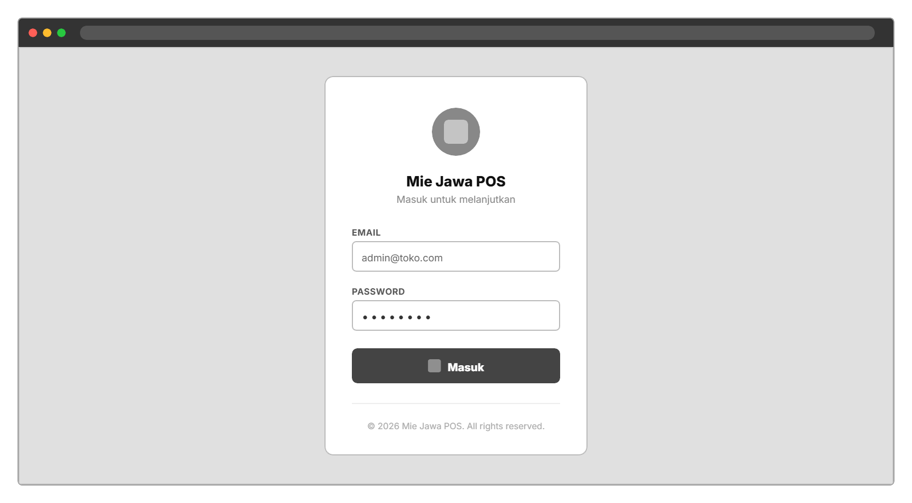

*Gambar 3.1 Rancangan Antarmuka Halaman Login — Tampilan Komputer*

Pada tampilan ponsel, tampilan dan susunan formulir tetap sama dengan versi komputer karena desainnya sudah menyesuaikan ukuran layar secara otomatis. Tombol **Masuk** dirancang dengan lebar yang mengisi penuh layar agar mudah ditekan dengan ibu jari.

<!-- SISIPKAN: Gambar 3.2 — WF-00-M.png (lebar 6 cm, center) -->
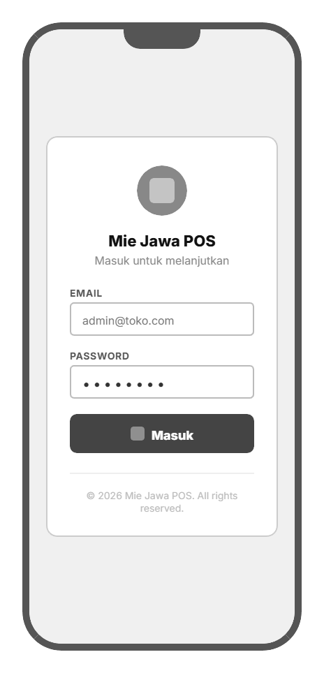

*Gambar 3.2 Rancangan Antarmuka Halaman Login — Tampilan Ponsel*

**Tampilan Kondisi Kesalahan Masuk** ditampilkan apabila pengguna memasukkan alamat surel atau kata sandi yang tidak sesuai dengan data yang tersimpan dalam sistem. Pada kondisi ini, batas tepi kolom isian berubah menjadi warna merah sebagai tanda visual bahwa data yang dimasukkan tidak valid, dan sebuah pesan kesalahan muncul di atas formulir yang menginformasikan kepada pengguna agar memeriksa kembali data yang dimasukkan. Mekanisme validasi ini berfungsi sebagai lapisan keamanan pertama yang memastikan hanya pengguna yang berwenang yang dapat mengakses sistem.

<!-- SISIPKAN: Gambar 3.3 — WF-00-E.png (lebar 14 cm, center) -->
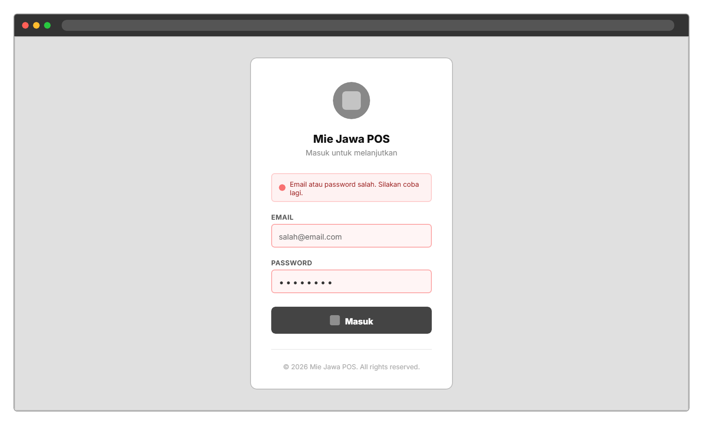

*Gambar 3.3 Rancangan Antarmuka Halaman Login — Kondisi Kesalahan Masuk*

---

## 3.5.2 Halaman Beranda

Halaman Beranda merupakan halaman pertama yang ditampilkan setelah pengguna berhasil masuk ke dalam sistem dan berfungsi sebagai pusat tindakan cepat (*home hub*). Halaman ini menampilkan sapaan selamat datang beserta nama toko dan waktu, ringkasan omzet serta jumlah transaksi hari ini, dan empat tombol tindakan cepat yang mengarahkan pengguna ke fitur-fitur utama aplikasi.

Pada tampilan komputer, menu navigasi utama ditempatkan di sisi kiri layar dalam bentuk bilah sisi (*sidebar*) vertikal yang memuat enam item menu, yaitu Beranda, Kasir, Dashboard, Produk, Laporan, dan Pengaturan, dengan item Beranda dalam kondisi aktif. Bagian konten utama menampilkan banner sapaan, dua kartu ringkasan statistik, serta empat kartu tindakan cepat.

<!-- SISIPKAN: Gambar 3.4 — WF-01-D.png (lebar 15 cm, center) -->
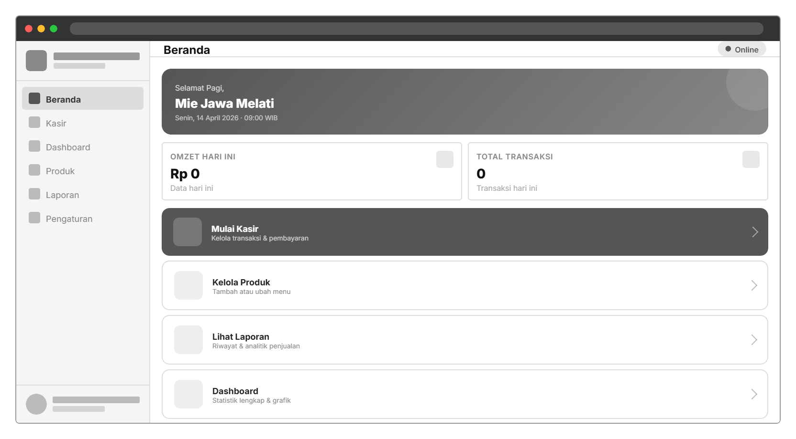

*Gambar 3.4 Rancangan Antarmuka Halaman Beranda — Tampilan Komputer*

Pada tampilan ponsel, menu navigasi berpindah ke bilah tab bawah (*bottom tab bar*) yang terdiri dari lima tab, yaitu Beranda, Kasir, Produk, Laporan, dan Akun. Susunan konten Beranda pada tampilan ponsel menjadi satu kolom vertikal agar mudah dijangkau dengan ibu jari.

<!-- SISIPKAN: Gambar 3.5 — WF-01-M.png (lebar 6 cm, center) -->
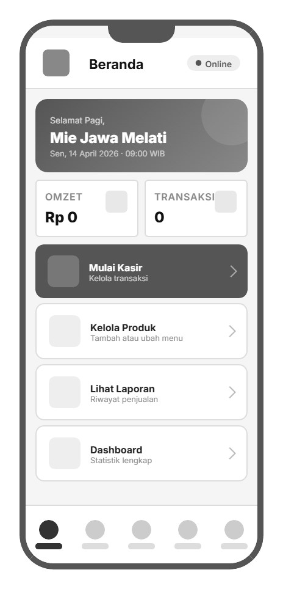

*Gambar 3.5 Rancangan Antarmuka Halaman Beranda — Tampilan Ponsel*

---

## 3.5.3 Halaman Dashboard

Halaman Dashboard merupakan halaman analitik yang dapat diakses melalui menu navigasi dan berfungsi menyajikan ringkasan kinerja penjualan secara menyeluruh. Halaman ini membantu pemilik usaha memantau perkembangan bisnis secara berkala tanpa perlu membuka riwayat transaksi satu per satu.

Pada tampilan komputer, item Dashboard pada bilah sisi ditampilkan dalam kondisi aktif. Konten utama terdiri dari empat kartu indikator kinerja di bagian atas yang memuat total pendapatan hari ini, jumlah transaksi, rata-rata nilai transaksi, dan produk terlaku. Di bawah kartu indikator tersebut terdapat grafik garis yang menampilkan tren pendapatan selama tujuh hari terakhir serta daftar produk terlaris dalam bentuk tabel ringkas.

<!-- SISIPKAN: Gambar 3.6 — WF-01H-D.png (lebar 15 cm, center) -->
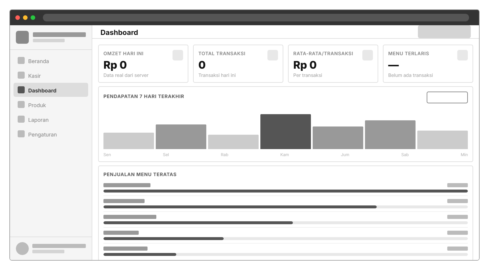

*Gambar 3.6 Rancangan Antarmuka Halaman Dashboard — Tampilan Komputer*

Pada tampilan ponsel, konten Dashboard disusun dalam satu kolom vertikal dengan kartu indikator di bagian paling atas, diikuti grafik pendapatan, dan tabel produk terlaris di bagian bawah. Halaman ini dapat diakses melalui tombol tindakan cepat di halaman Beranda.

<!-- SISIPKAN: Gambar 3.7 — WF-01H-M.png (lebar 6 cm, center) -->
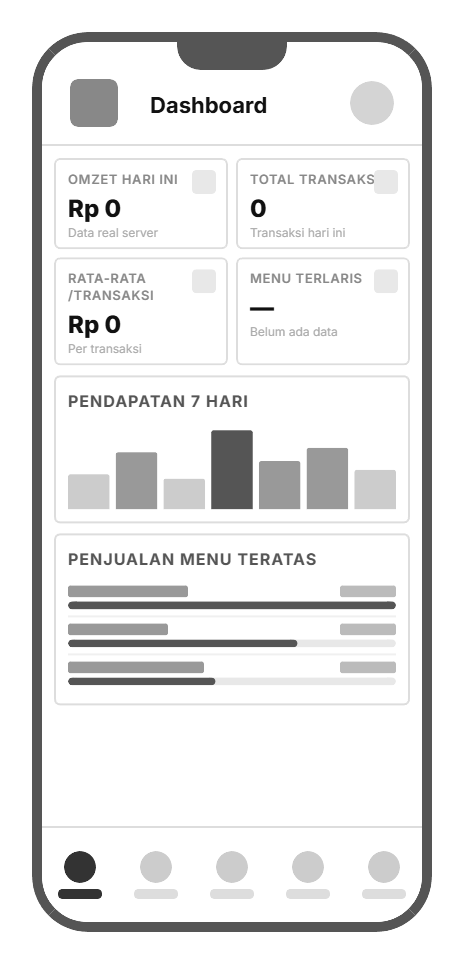

*Gambar 3.7 Rancangan Antarmuka Halaman Dashboard — Tampilan Ponsel*

---

## 3.5.4 Halaman Kasir (Transaksi Penjualan)

Halaman Kasir merupakan halaman utama untuk mencatat transaksi penjualan. Halaman ini menampilkan daftar menu dalam bentuk kartu yang memuat foto produk, nama, dan harga. Di bagian atas halaman terdapat pilihan kategori produk yang dapat dipilih untuk menyaring tampilan daftar menu, dan pilihan kategori ini akan tetap terlihat meskipun pengguna menggulir halaman ke bawah.

Pada tampilan komputer, bilah sisi vertikal menampilkan item Kasir dalam kondisi aktif. Daftar menu ditampilkan di bagian tengah layar dalam susunan grid, sementara panel pesanan aktif berada di sisi kanan layar dan menampilkan daftar item beserta total harga yang dihitung secara langsung setiap kali ada perubahan. Kasir dapat mengubah jumlah setiap item, menambahkan catatan khusus, atau mengosongkan seluruh pesanan tanpa perlu berpindah halaman.

<!-- SISIPKAN: Gambar 3.8 — WF-02-D.png (lebar 15 cm, center) -->
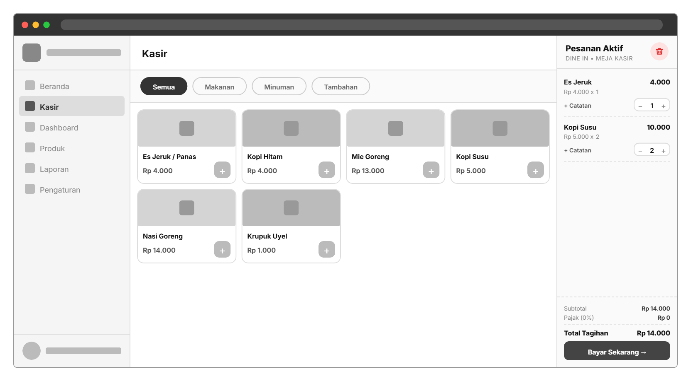

*Gambar 3.8 Rancangan Antarmuka Halaman Kasir — Tampilan Komputer*

Pada tampilan ponsel, daftar menu mengisi seluruh layar agar lebih mudah dibaca. Tombol **Lihat Pesanan** ditampilkan sebagai tombol yang melayang di sudut kanan bawah layar. Apabila tombol tersebut ditekan, panel daftar pesanan akan muncul dari bagian bawah layar sehingga kasir dapat meninjau dan mengubah pesanan tanpa meninggalkan tampilan daftar menu.

<!-- SISIPKAN: Gambar 3.9 — WF-02-M.png (lebar 6 cm, center) -->
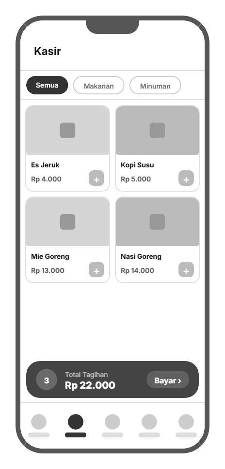

*Gambar 3.9 Rancangan Antarmuka Halaman Kasir — Tampilan Ponsel*

**Tampilan Konfirmasi Pembayaran** muncul di atas halaman kasir setelah kasir menekan tombol **Bayar**. Tampilan ini memuat ringkasan pesanan, pilihan metode pembayaran berupa Tunai, QRIS, atau Transfer Bank, serta kolom isian jumlah uang yang diterima dari pelanggan. Untuk mempercepat proses, sistem menyediakan tombol nominal cepat (15K, 20K, 50K, 100K) yang dapat ditekan sebagai pintasan pengisian jumlah uang. Sistem menghitung dan menampilkan jumlah kembalian secara otomatis berdasarkan uang yang dimasukkan oleh kasir.

<!-- SISIPKAN: Gambar 3.10 — WF-02-MC.png (lebar 9 cm, center) -->
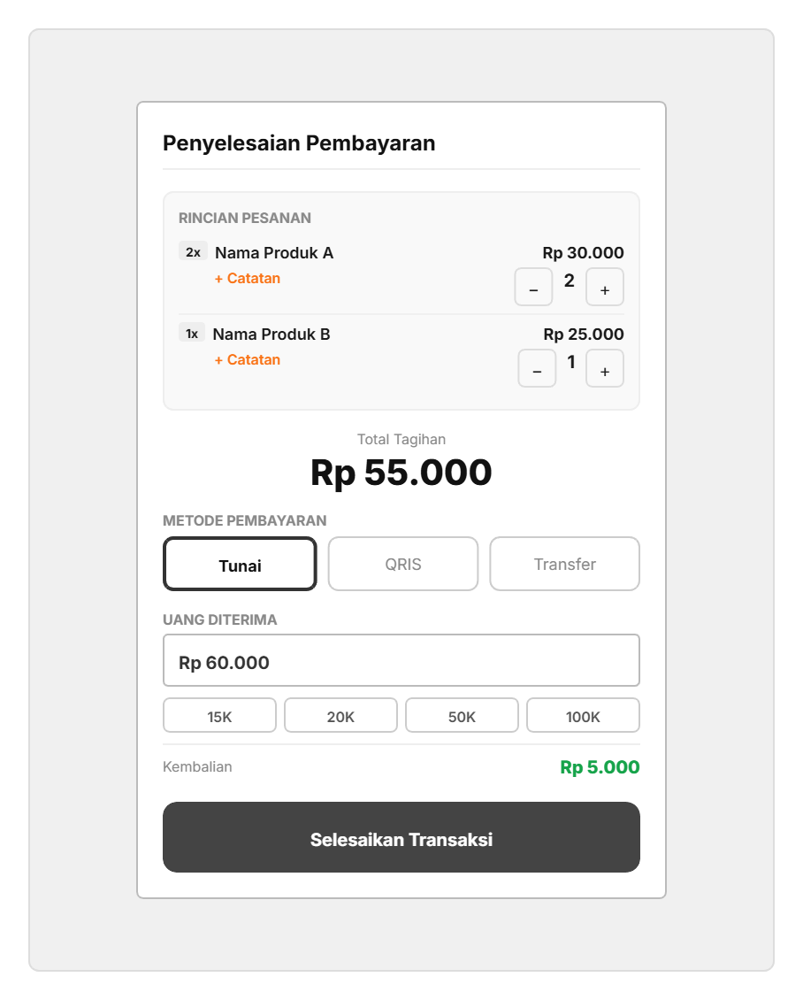

*Gambar 3.10 Rancangan Antarmuka Halaman Kasir — Tampilan Konfirmasi Pembayaran*

**Halaman Nota Pembayaran** ditampilkan setelah transaksi berhasil diselesaikan. Nota digital ini menampilkan identitas toko (nama, alamat, nomor telepon, logo), nomor nota, waktu transaksi, nama kasir, rincian item yang dibeli beserta catatan khusus apabila ada, subtotal, total tagihan, metode pembayaran, jumlah uang diterima, serta kembalian. Format tampilan nota mengikuti standar struk kasir pada umumnya. Kasir dapat memilih untuk mencetak nota ke printer yang terhubung melalui Bluetooth atau menutup tampilan apabila pelanggan tidak memerlukan struk fisik.

<!-- SISIPKAN: Gambar 3.11 — WF-02-MR.png (lebar 8 cm, center) -->
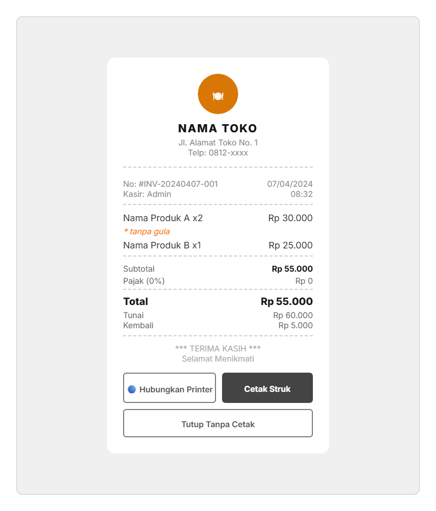

*Gambar 3.11 Rancangan Antarmuka Halaman Kasir — Tampilan Nota Pembayaran*

**Tampilan Modal Catatan Pesanan** muncul ketika kasir menekan tautan **+ Catatan** pada salah satu item di daftar pesanan aktif. Melalui modal ini, kasir dapat menambahkan catatan khusus untuk item tertentu tanpa mengubah data produk yang ada di sistem. Terdapat dua cara pemberian catatan, yaitu memilih varian atau permintaan yang telah tersedia dalam bentuk tombol *pill* yang dapat dipilih lebih dari satu sekaligus, serta mengetik catatan bebas pada kolom teks di bawahnya. Catatan yang sedang disusun ditampilkan secara langsung dalam kotak pratinjau di bagian atas modal sehingga kasir dapat memastikan kebenaran catatan sebelum menyimpannya. Setelah tombol **Simpan Catatan** ditekan, catatan tersebut akan tersimpan pada item terkait dan turut tercetak pada nota pembayaran.

<!-- SISIPKAN: Gambar 3.12 — WF-02-MN.png (lebar 9 cm, center) -->
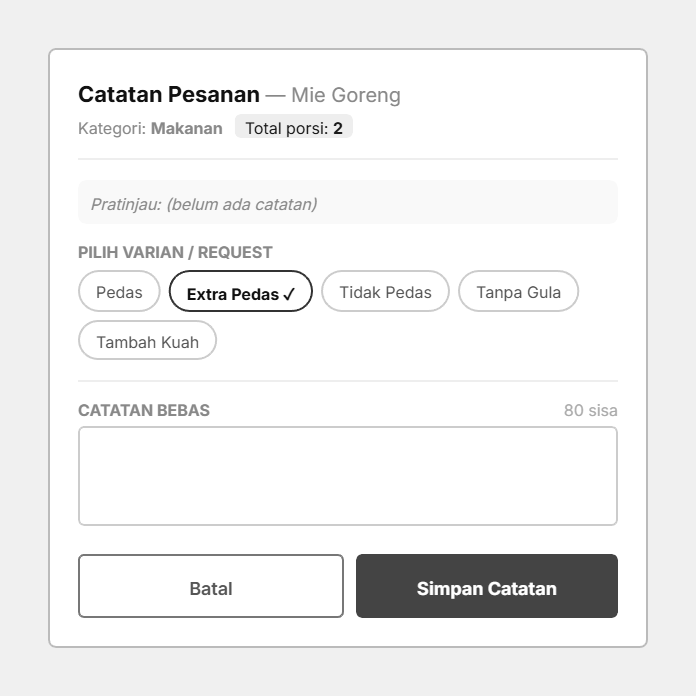

*Gambar 3.12 Rancangan Antarmuka Halaman Kasir — Tampilan Modal Catatan Pesanan*

---

## 3.5.5 Halaman Manajemen Produk

Halaman Manajemen Produk berfungsi sebagai tempat bagi pemilik usaha untuk mengelola data menu yang tersedia di aplikasi. Halaman ini menampilkan daftar seluruh produk dalam bentuk tabel yang memuat informasi nama produk, kategori, harga, dan status ketersediaan. Di bagian atas tabel terdapat kolom pencarian yang memungkinkan pemilik usaha mencari produk tertentu dengan mengetikkan nama produk, dan hasilnya akan muncul secara langsung tanpa perlu menekan tombol tambahan.

Pada tampilan komputer, bilah sisi vertikal menampilkan item Produk dalam kondisi aktif. Tabel daftar produk menampilkan setiap produk dalam satu baris. Di ujung kanan setiap baris terdapat dua tombol aksi, yaitu tombol **Ubah** untuk membuka formulir pengeditan dan tombol **Hapus** untuk menghapus produk dari sistem. Di bagian atas halaman terdapat tombol **Tambah Produk** dan tombol **Kelola Kategori** yang dapat diakses dengan mudah.

<!-- SISIPKAN: Gambar 3.13 — WF-03-D.png (lebar 15 cm, center) -->
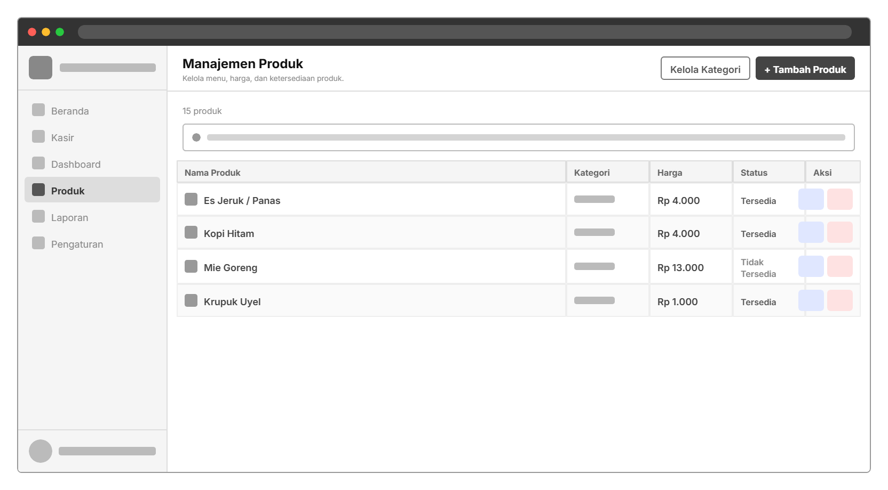

*Gambar 3.13 Rancangan Antarmuka Halaman Manajemen Produk — Tampilan Komputer*

Pada tampilan ponsel, tabel daftar produk ditampilkan dengan baris yang lebih ringkas agar lebih banyak data yang dapat dilihat dalam satu layar. Produk yang ditandai sebagai tidak tersedia ditampilkan dengan warna yang lebih pudar sebagai tanda visual bahwa produk tersebut sedang tidak aktif. Tombol **Ubah** dan **Hapus** tetap tersedia di ujung kanan setiap baris.

<!-- SISIPKAN: Gambar 3.14 — WF-03-M.png (lebar 6 cm, center) -->
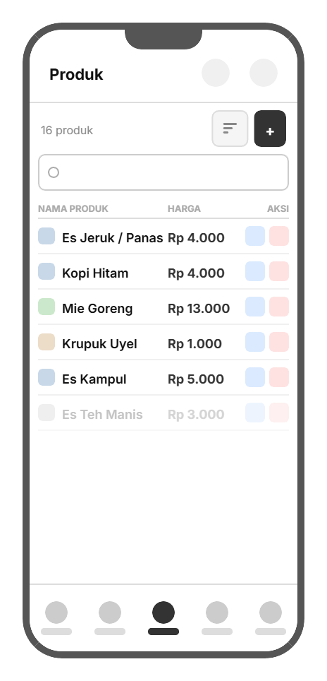

*Gambar 3.14 Rancangan Antarmuka Halaman Manajemen Produk — Tampilan Ponsel*

**Formulir Tambah/Ubah Produk** ditampilkan sebagai jendela yang muncul di atas halaman saat tombol **Tambah Produk** atau **Ubah** ditekan. Formulir ini memuat kolom untuk nama produk, kategori, harga jual, area unggah foto produk, serta tombol aktif/nonaktif untuk mengatur status ketersediaan produk. Pemilik usaha tidak perlu mengelola data stok secara angka; cukup mengatur status produk menjadi aktif atau nonaktif untuk menentukan apakah produk tersebut ditampilkan di halaman Kasir.

<!-- SISIPKAN: Gambar 3.15 — WF-03-MF.png (lebar 9 cm, center) -->
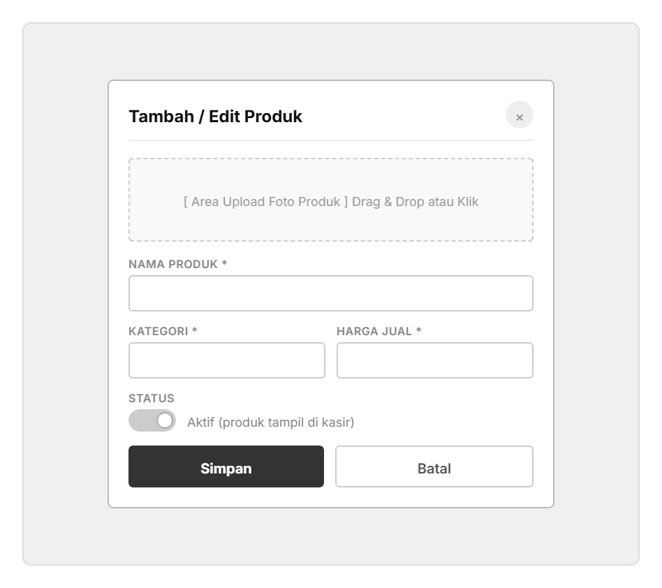

*Gambar 3.15 Rancangan Antarmuka Halaman Manajemen Produk — Formulir Tambah/Ubah Produk*

**Tampilan Kelola Kategori** memungkinkan pemilik usaha menambah, mengubah, atau menghapus kelompok kategori produk. Setiap kategori menampilkan jumlah produk yang terhubung sehingga pemilik usaha dapat mengetahui distribusi produk per kategori dengan cepat. Kategori baru dapat ditambahkan langsung melalui kolom isian yang tersedia di bagian bawah jendela.

<!-- SISIPKAN: Gambar 3.16 — WF-03-MK.png (lebar 9 cm, center) -->
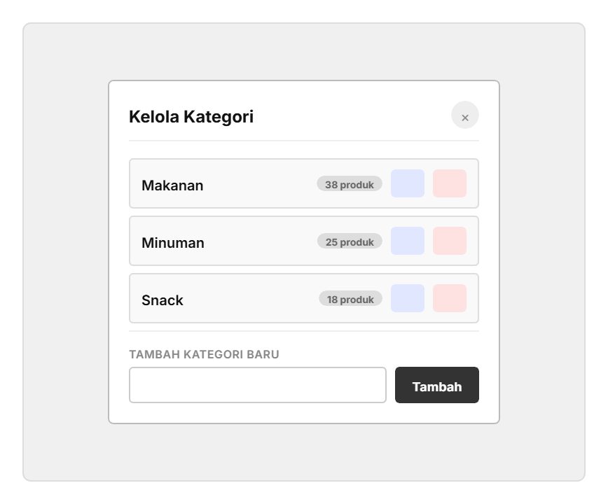

*Gambar 3.16 Rancangan Antarmuka Halaman Manajemen Produk — Tampilan Kelola Kategori*

---

## 3.5.6 Halaman Laporan Penjualan

Halaman Laporan Penjualan menyajikan riwayat seluruh transaksi yang pernah terjadi dalam sistem. Data transaksi ditampilkan dalam bentuk tabel yang memuat nomor nota, waktu transaksi, metode pembayaran, jumlah item, dan total nominal transaksi. Di bagian atas halaman terdapat tiga kartu indikator yang menampilkan total pendapatan, jumlah transaksi, dan rata-rata nilai transaksi untuk periode yang sedang ditampilkan.

Pada tampilan komputer, bilah sisi vertikal menampilkan item Laporan dalam kondisi aktif. Pengguna dapat menyaring data menggunakan pilihan rentang tanggal dan jenis metode pembayaran yang tersedia di bagian atas tabel. Terdapat pula tombol **Ekspor CSV** yang memungkinkan pemilik usaha mengunduh data transaksi dalam format berkas yang dapat dibuka menggunakan aplikasi pengolah angka seperti Microsoft Excel untuk keperluan analisis lebih lanjut. Setiap baris transaksi dilengkapi tombol untuk melihat detail pesanan dan tombol untuk menghapus data transaksi.

<!-- SISIPKAN: Gambar 3.17 — WF-04-D.png (lebar 15 cm, center) -->
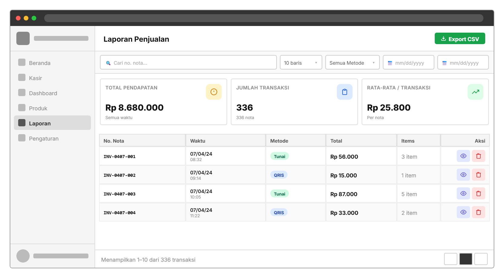

*Gambar 3.17 Rancangan Antarmuka Halaman Laporan Penjualan — Tampilan Komputer*

Pada tampilan ponsel, kartu indikator disusun secara vertikal dengan kartu total pendapatan ditampilkan paling atas. Pilihan penyaringan tanggal dan metode pembayaran ditempatkan dalam dua baris di atas tabel agar tetap dapat diakses dengan mudah. Beberapa kolom tabel yang kurang penting disembunyikan pada tampilan ponsel untuk menghemat ruang layar, namun tetap ditampilkan pada tampilan komputer.

<!-- SISIPKAN: Gambar 3.18 — WF-04-M.png (lebar 6 cm, center) -->
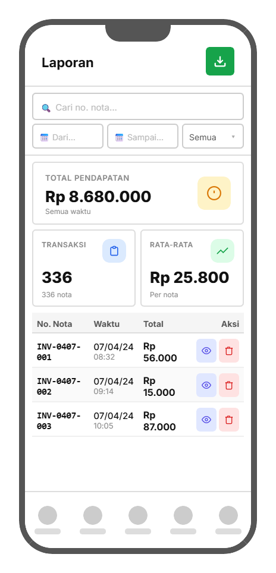

*Gambar 3.18 Rancangan Antarmuka Halaman Laporan Penjualan — Tampilan Ponsel*

**Tampilan Detail Transaksi** muncul saat pengguna menekan tombol lihat detail pada salah satu baris transaksi. Tampilan ini memuat informasi lengkap tentang transaksi tersebut, termasuk nomor nota, waktu, metode pembayaran, daftar item yang dibeli beserta harga satuan, jumlah, dan catatan item apabila ada, serta rincian total pembayaran dan kembalian. Terdapat pula tombol untuk mencetak ulang struk apabila diperlukan.

<!-- SISIPKAN: Gambar 3.19 — WF-04-MD.png (lebar 9 cm, center) -->
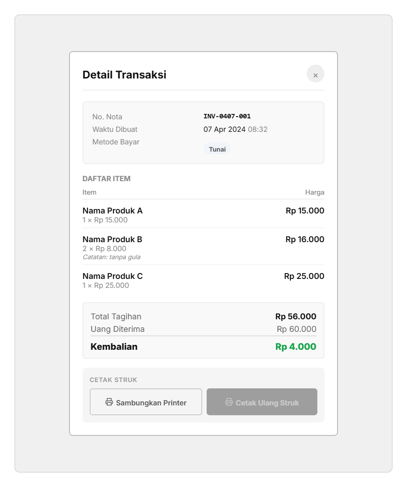

*Gambar 3.19 Rancangan Antarmuka Halaman Laporan Penjualan — Tampilan Detail Transaksi*

---

## 3.5.7 Halaman Pengaturan Toko

Halaman Pengaturan Toko merupakan pusat pengelolaan konfigurasi sistem yang terpisah dari proses transaksi. Antarmuka ini dirancang secara modular agar fungsi manajemen konfigurasi usaha dapat dikelola tanpa merusak alur kerja utama aplikasi.

**Tampilan Komputer** mengadopsi pola *master-detail* dengan navigasi lateral di sebelah kiri, memisahkan domain konfigurasi (seperti profil bisnis dan preferensi periferal) ke dalam ruang kerja yang fokus. Pendekatan tata letak ini mematuhi prinsip kohesi operasional (*operational cohesion*), memastikan kurasi administratif terpusat yang terisolasi dari proses transaksional yang rentan terhadap interupsi.

<!-- SISIPKAN: Gambar 3.20 — WF-05-D.png (lebar 15 cm, center) -->
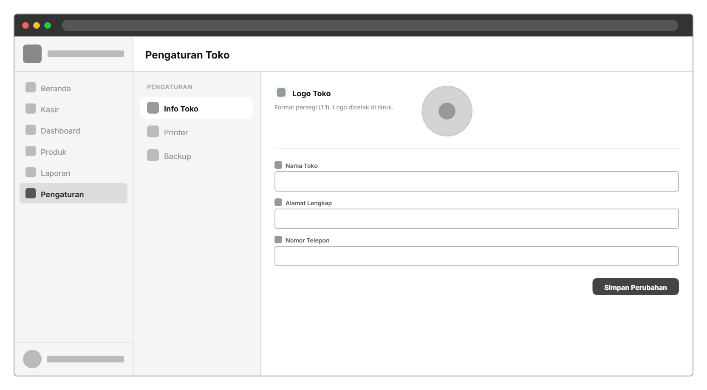

*Gambar 3.20 Rancangan Antarmuka Halaman Pengaturan Toko — Tampilan Komputer*

**Tampilan Ponsel** mentransformasi navigasi lateral menjadi komponen *Pill-Tab* horizontal dinamis guna mengkompensasi konstrain spasial perangkat genggam portabel. Perubahan pemformatan relasional ini memastikan fungsi manajemen profil tetap mudah dijangkau sekalipun diutilisasi dalam skenario operasional bermobilitas tinggi dan penggunaan peranti dengan resolusi terbatas.

<!-- SISIPKAN: Gambar 3.21 — WF-05-M.png (lebar 6 cm, center) -->
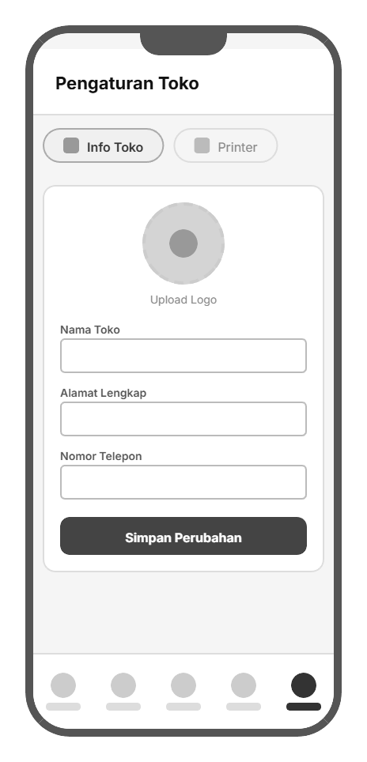

*Gambar 3.21 Rancangan Antarmuka Halaman Pengaturan Toko — Tampilan Ponsel*

**Tampilan Panel Informasi Toko** berfungsi sebagai area sentral untuk mengelola identitas dan visibilitas toko. Panel ini memuat fasilitas pengunggahan logo, yang akan dicetak secara otomatis pada struk fisik apabila diaktifkan, serta formulir untuk memutakhirkan nama toko, alamat lengkap, dan nomor kontak. Penyusunan informasi ini dikemas dalam sebuah antarmuka yang mengutamakan kejelasan, sehingga modifikasi data profil usaha dapat dilakukan secara efisien tanpa komplikasi navigasi.

<!-- SISIPKAN: Gambar 3.22 — WF-05-PI.png (lebar 9 cm, center) -->
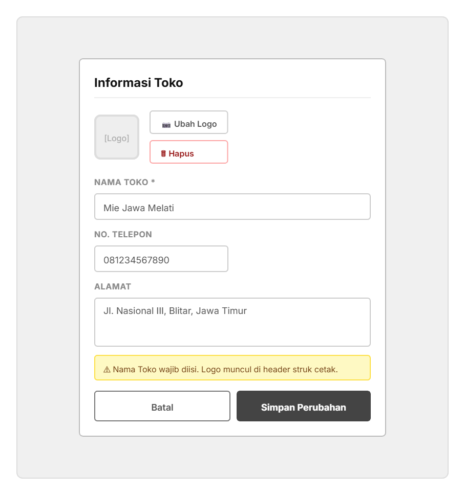

*Gambar 3.22 Rancangan Antarmuka Halaman Pengaturan Toko — Tampilan Panel Informasi Toko*

**Tampilan Panel Pengaturan Printer** menyajikan antarmuka diagnostik dan konfigurasi khusus untuk perangkat pencetak tanda terima nirkabel (*wireless thermal printer*). Melalui panel ini, sistem memvisualisasikan status koneksi *Bluetooth* secara aktual. Pemilik usaha disediakan tombol kendali cepat (*toggle*) guna menetapkan preferensi sistem pencetakan, meliputi automasi cetak pascatransaksi, penyertaan logo visual, serta pengaturan format pencetakan struktur penutup (*footer*) pada nota.

<!-- SISIPKAN: Gambar 3.23 — WF-05-PP.png (lebar 9 cm, center) -->
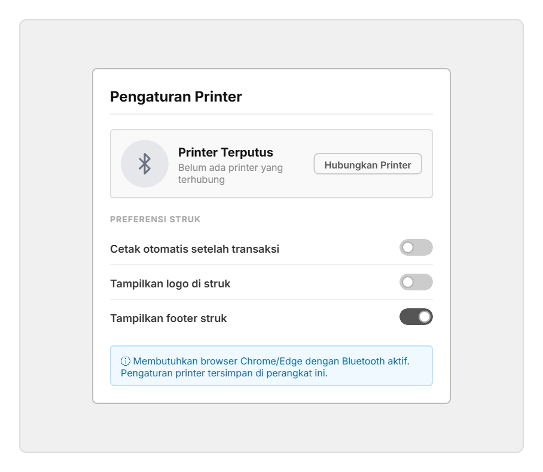

*Gambar 3.23 Rancangan Antarmuka Halaman Pengaturan Toko — Tampilan Panel Pengaturan Printer*

**Tampilan Panel Profil Akun** pada perangkat komputer bertindak sebagai ruang administratif untuk pengelolaan kredensial keamanan pengguna. Struktur panel ini dirancang secara dikotomis, memisahkan wilayah informasi dasar (alamat surel dan nama tampilan) dari kompartemen otentikasi (pembaruan kata sandi). Pemisahan spasial ini merupakan implementasi tata letak keamanan proaktif guna meminimalkan risiko modifikasi kata sandi secara tidak sengaja oleh operator sistem.

<!-- SISIPKAN: Gambar 3.24 — WF-05-AC.png (lebar 10 cm, center) -->
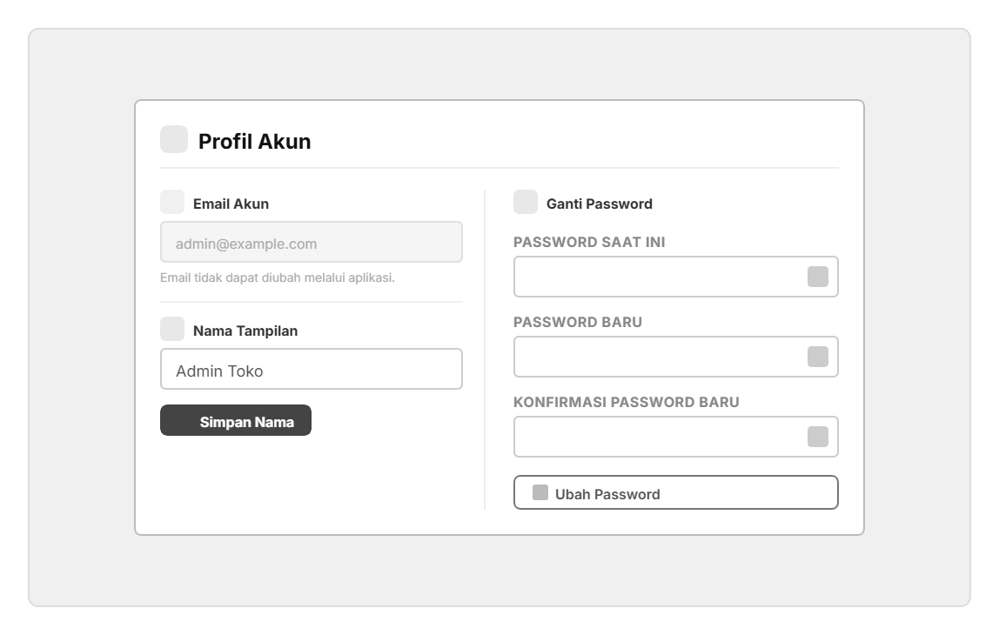

*Gambar 3.24 Rancangan Antarmuka Halaman Pengaturan Toko — Tampilan Panel Profil Akun*

**Tampilan Menu Akun Ponsel** mengimplementasikan mekanisme *bottom sheet overlay* pada antarmuka perangkat bergerak. Komponen navigasi ini dirancang untuk menyembunyikan opsi manajemen profil dari area kerja utama agar tidak mendistorsi konsentrasi pengguna pada antarmuka operasional. Tindakan berisiko tinggi seperti terminasi sesi (keluar aplikasi) diberi penekanan visual warna merah (*destructive red*) untuk meningkatkan kewaspadaan pengguna sebelum mengonfirmasi tindakan tersebut.

<!-- SISIPKAN: Gambar 3.25 — WF-05-AS.png (lebar 6 cm, center) -->
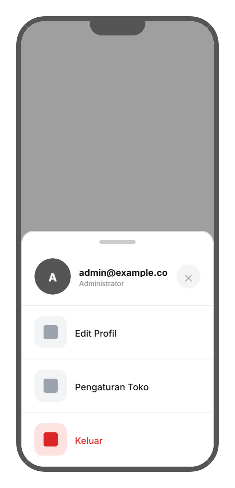

*Gambar 3.25 Rancangan Antarmuka Halaman Pengaturan Toko — Tampilan Menu Akun Ponsel*

---

## Tabel Pemetaan Gambar — Daftar Gambar BAB III

Gunakan tabel ini untuk menyusun **Daftar Gambar** pada dokumen skripsi.

| No. Gambar | Kode File | Keterangan Resmi |
|:----------:|-----------|------------------|
| Gambar 3.1 | `WF-00-D.png` | Rancangan Antarmuka Halaman Login — Tampilan Komputer |
| Gambar 3.2 | `WF-00-M.png` | Rancangan Antarmuka Halaman Login — Tampilan Ponsel |
| Gambar 3.3 | `WF-00-E.png` | Rancangan Antarmuka Halaman Login — Kondisi Kesalahan Masuk |
| Gambar 3.4 | `WF-01H-D.png` | Rancangan Antarmuka Halaman Beranda — Tampilan Komputer |
| Gambar 3.5 | `WF-01H-M.png` | Rancangan Antarmuka Halaman Beranda — Tampilan Ponsel |
| Gambar 3.6 | `WF-01-D.png` | Rancangan Antarmuka Halaman Dashboard — Tampilan Komputer |
| Gambar 3.7 | `WF-01-M.png` | Rancangan Antarmuka Halaman Dashboard — Tampilan Ponsel |
| Gambar 3.8 | `WF-02-D.png` | Rancangan Antarmuka Halaman Kasir — Tampilan Komputer |
| Gambar 3.9 | `WF-02-M.png` | Rancangan Antarmuka Halaman Kasir — Tampilan Ponsel |
| Gambar 3.10 | `WF-02-MC.png` | Rancangan Antarmuka Halaman Kasir — Tampilan Konfirmasi Pembayaran |
| Gambar 3.11 | `WF-02-MR.png` | Rancangan Antarmuka Halaman Kasir — Tampilan Nota Pembayaran |
| Gambar 3.12 | `WF-02-MN.png` | Rancangan Antarmuka Halaman Kasir — Tampilan Modal Catatan Pesanan |
| Gambar 3.13 | `WF-03-D.png` | Rancangan Antarmuka Halaman Manajemen Produk — Tampilan Komputer |
| Gambar 3.14 | `WF-03-M.png` | Rancangan Antarmuka Halaman Manajemen Produk — Tampilan Ponsel |
| Gambar 3.15 | `WF-03-MF.png` | Rancangan Antarmuka Halaman Manajemen Produk — Formulir Tambah/Ubah Produk |
| Gambar 3.16 | `WF-03-MK.png` | Rancangan Antarmuka Halaman Manajemen Produk — Tampilan Kelola Kategori |
| Gambar 3.17 | `WF-04-D.png` | Rancangan Antarmuka Halaman Laporan Penjualan — Tampilan Komputer |
| Gambar 3.18 | `WF-04-M.png` | Rancangan Antarmuka Halaman Laporan Penjualan — Tampilan Ponsel |
| Gambar 3.19 | `WF-04-MD.png` | Rancangan Antarmuka Halaman Laporan Penjualan — Tampilan Detail Transaksi |
| Gambar 3.20 | `WF-05-D.png` | Rancangan Antarmuka Halaman Pengaturan Toko — Tampilan Komputer |
| Gambar 3.21 | `WF-05-M.png` | Rancangan Antarmuka Halaman Pengaturan Toko — Tampilan Ponsel |
| Gambar 3.22 | `WF-05-PI.png` | Rancangan Antarmuka Halaman Pengaturan Toko — Tampilan Panel Informasi Toko |
| Gambar 3.23 | `WF-05-PP.png` | Rancangan Antarmuka Halaman Pengaturan Toko — Tampilan Panel Pengaturan Printer |
| Gambar 3.24 | `WF-05-AC.png` | Rancangan Antarmuka Halaman Pengaturan Toko — Tampilan Panel Profil Akun |
| Gambar 3.25 | `WF-05-AS.png` | Rancangan Antarmuka Halaman Pengaturan Toko — Tampilan Menu Akun Ponsel |

---

## Panduan Teknis — Cara Integrasi ke Dokumen Word

### Ukuran Gambar yang Disarankan

| Jenis | Contoh File | Lebar di Word | Catatan |
|-------|-------------|:-------------:|---------|
| Desktop / Landscape | `WF-0X-D.png` | **14–15 cm** | Hampir penuh halaman |
| Ponsel / Portrait | `WF-0X-M.png`, `WF-05-AS.png` | **5.5–6.5 cm** | Tampilkan di tengah |
| Modal Kotak Besar | `WF-02-MC`, `WF-02-MR`, `WF-02-MN`, `WF-04-MD`, `WF-05-AC.png` | **8–10 cm** | Center |
| Modal Kotak Kecil | `WF-03-MF`, `WF-03-MK`, `WF-05-PI.png`, `WF-05-PP.png` | **7–9 cm** | Center |

### Langkah Penyisipan di Word

1. Posisikan kursor di **bawah paragraf** yang sesuai
2. **Insert → Pictures → This Device** → pilih file dari `docs\wireframe\export\`
3. Klik gambar → **Picture Format → Size** → atur lebar sesuai tabel di atas, biarkan tinggi otomatis
4. Klik kanan gambar → **Wrap Text → Top and Bottom**
5. Klik gambar → atur **Center alignment**
6. Klik kanan gambar → **Insert Caption** → ketik nomor dan teks keterangan
7. Setelah semua gambar selesai → pergi ke **Daftar Gambar** → klik **Update Field → Update entire table**

### Format Keterangan Gambar

```
Gambar 3.X Rancangan Antarmuka [Nama Halaman] — [Tampilan/Kondisi]
```

Contoh:
- `Gambar 3.6 Rancangan Antarmuka Halaman Kasir — Tampilan Komputer`
- `Gambar 3.8 Rancangan Antarmuka Halaman Kasir — Tampilan Konfirmasi Pembayaran`

---

*File ini dibuat otomatis sebagai referensi integrasi wireframe skripsi.*
*Sumber gambar: `docs/wireframe/export/` — 25 file PNG dengan latar belakang putih.*
